# Homework: Algorithm Complexity and Linear Data Structures

This document defines the homework assignments for the "Data Structures" course @ Software University.
You can check your solutions here: https://judge.softuni.bg/Contests/Practice/Index/551#0

### Problem 1. Sum and Average

Write a program that reads from the console a sequence of integer numbers (on a single line, separated by a space). Calculate and print the sum and average of the elements of the sequence. Keep the sequence in List<**int**>. Round the average to second digit after the decimal separator.

<table>
<thead>
<tr>
<th>Input</th>
<th>Output</th>
</tr>
</thead>
<tbody>
<tr>
<td>4 5 6</td>
<td>Sum=15; Average=5.00</td>
</tr>
<tr>
<td>1 1</td>
<td>Sum=2; Average=1.00</td>
</tr>
<tr>
<td></td>
<td>Sum=0; Average=0.00</td>
</tr>
<tr>
<td>10</td>
<td>Sum=10; Average=10.00</td>
</tr>
<tr>
<td>2 2 1</td>
<td>Sum=5; Average=1.67</td>
</tr>
</tbody>
</table>

<b>Solution: <a href="./homework/src/Ex01SumAndAverage.java">Ex01SumAndAverage.java</a></b>

### Problem 2. Sort Words

Write a program that reads from the console a sequence of words (strings on a single line, separated by a space). Sort them alphabetically. Keep the sequence in List<**string**>.

<table>
<thead>
<tr>
<th>Input</th>
<th>Output</th>
</tr>
</thead>
<tbody>
<tr>
<td>wow softuni alpha</td>
<td>alpha softuni wow</td>
</tr>
<tr>
<td>hi</td>
<td>hi</td>
</tr>
<tr>
<td>rakiya beer wine vodka whiskey</td>
<td>beer rakiya vodka whiskey wine</td>
</tr>
</tbody>
</table>

<b>Solution: <a href="./homework/src/Ex02SortWords.java">Ex02SortWords.java</a></b>

<b>Solution: <a href="./homework/src/Ex02SortWords01.java">Ex02SortWords01.java</a></b>

### Problem 3. Longest Subsequence

Write a method that finds the longest subsequence of equal numbers in given List<**int**> and returns the result as new List<**int**>. If several sequences has the same longest length, return the leftmost of them. Write a program to test whether the method works correctly.

<table>
<thead>
<tr>
<th>Input</th>
<th>Output</th>
</tr>
</thead>
<tbody>
<tr>
<td>12 2 7 4 3 3 8</td>
<td>3 3</td>
</tr>
<tr>
<td>2 2 2 3 3 3</td>
<td>2 2 2</td>
</tr>
<tr>
<td>4 4 5 5 5</td>
<td>5 5 5</td>
</tr>
<tr>
<td>1 2 3</td>
<td>1</td>
</tr>
<tr>
<td>0</td>
<td>0</td>
</tr>
<tr>
<td>4 2 3 4 4</td>
<td>4 4</td>
</tr>
</tbody>
</table>

<b>Solution: <a href="./homework/src/Ex03LongestSubSequence.java">Ex03LongestSubSequence.java</a></b>

<b>Solution: <a href="./homework/src/Ex03LongestSubSequence01.java">Ex03LongestSubSequence01.java</a></b>

<b>Solution: <a href="./homework/src/Ex03LongestSubSequence02.java">Ex03LongestSubSequence02.java</a></b>

### Problem 4. Remove Odd Occurrences

Write a program that removes from given sequence all numbers that occur odd number of times.

<table>
<thead>
<tr>
<th>Input</th>
<th>Output</th>
<th>Comments</th>
</tr>
</thead>
<tbody>
<tr>
<td>1 2 3 4 1</td>
<td>1 1</td>
<td>2, 3 and 4 occur odd number of times (once). 1 occurs 2 times   </td>
</tr>
<tr>
<td>1 2 3 4 5 3 6 7 6 7 6</td>
<td>3 3 7 7	</td>
<td>1, 2, 4, 5 and 6 occurs odd number of times -> removed</td>
</tr>
<tr>
<td>1 2 1 2 1 2</td>
<td></td>
<td>All numbers occur odd number of times -> removed</td>
</tr>
<tr>
<td>3 7 3 3 4 3 4 3 7</td>
<td>7 4 4 7	</td>
<td>3 occurs odd number of times (5) -> removed</td>
</tr>
<tr>
<td>1 1</td>
<td>1 1</td>
<td>All numbers occur even number of times -> sequence stays unchanged</td>
</tr>
</tbody>
</table>

<b>Solution: <a href="./homework/src/Ex04RemoveOddOccurrences.java">Ex04RemoveOddOccurrences.java</a></b>

### Problem 5. Count of Occurrences

Write a program that finds in given array of integers how many times each of them occurs. The input sequence holds numbers in range [0…1000]. The output should hold all numbers that occur at least once along with their number of occurrences.

<table>
<thead>
<tr>
<th>Input</th>
<th>Output</th>
</tr>
</thead>
<tbody>
<tr>
<td>3 4 4 2 3 3 4 3 2</td>
<td>2 -> 2 times 3 -> 4 times 4 -> 3 times</td>
</tr>
<tr>
<td>1000</td>
<td>1000 -> 1 times</td>
</tr>
<tr>
<td>0 0 0</td>
<td>0 -> 3 times</td>
</tr>
<tr>
<td>7 6 5 5 6</td>
<td>5 -> 2 times 6 -> 2 times 7 -> 1 times</td>
</tr>
</tbody>
</table>

<b>Solution: <a href="./homework/src/Ex05CountOccurrences01.java">Ex05CountOccurrences01.java</a></b>

<b>Solution: <a href="./homework/src/Ex05CountOfOccurrences.java">Ex05CountOfOccurrences.java</a></b>

### Problem 6. Implement the Data Structure ReversedList\<T>

Implement a data structure ReversedList\<T> that holds a sequence of elements of generic type T. It should hold a sequence of items in reversed order. The structure should have some capacity that grows twice when it is filled, always starting at 2. The reversed list should support the following operations:

- Add(T item) -> adds an element to the sequence (grow twice the underlying array to extend its capacity in case the capacity is full)
- Count -> returns the number of elements in the structure
- Capacity -> returns the capacity of the underlying array holding the elements of the structure
- this[index] -> the indexer should access the elements by index (in range 0 … Count-1) in the reverse order of adding
- RemoveAt(index) -> removes an element by index (in range 0 … Count-1) in the reverse order of adding
- IEnumerable\<T> -> implement an enumerator to allow iterating over the elements in a foreach loop in a reversed order of their addition

Note: For Java, instead of indexer, create methods get(int index) and set(int index, T element). All methods should be with the same names but lowercase.

Hint: you can keep the elements in the order of their adding, by access them in reversed order (from end to start).

<b>Java Impelementation: <a href="./reversedlist">Reversed List</a></b>

### Problem 7. \* Distance in Labyrinth

We are given a labyrinth of size N x N. Some of its cells are empty (0) and some are full (x). We can move from an empty cell to another empty cell if they share common wall. Given a starting position (*) calculate and fill in the array the minimal distance from this position to any other cell in the array. Use "u" for all unreachable cells.

<table>
<thead>
<tr>
<th>Input</th>
<th>Output</th>
</tr>
</thead>
<tbody>
<tr>
<td>2 x0 *x</td>
<td>xu *x</td>
</tr>
<tr>
<td>3 000 0*0 000</td>
<td>212 1*1 212</td>
</tr>
<tr>
<td>6 000x0x 0x0x0x 0*x0x0 0x0000 000xx0 000x0x</td>
<td>345xux 2x6xux 1*x8x10 2x6789 345xx10 456xux</td>
</tr>
</tbody>
</table>

<b>Solution: <a href="./homework/src/Ex07DistanceInLabyrinth.java">Ex07DistanceInLabyrinth.java</a></b>

### Problem 8. Implement a DoublyLinkedList\<T>

You are given a project skeleton that contains unit tests for a DoublyLinkedList\<T> data structure.

You have to implement a doubly linked list in C# or Java – a data structure that holds nodes, where each node knows its next and previous nodes:

Before starting, get familiar with the concept of doubly linked list: https://en.wikipedia.org/wiki/Doubly_linked_list.

The typical operations over a doubly linked list are add / remove element at both ends and traverse. By definition, the doubly linked list has a head (list start) and a tail (list end). Let's start coding!

### Implement ListNode\<T>

The first step when implementing a linked / doubly linked list is to understand that we need two classes:

- ListNode\<T> class to hold a single list node (its value + next node + previous node)
- DoublyLinkedList\<T> to hold the entire list (its head + tail + operations)

Now, let's write the list node class. It should hold a Value and a reference to its previous and next node. It can be inner class, because we will need it only internally from the doubly linked list class:

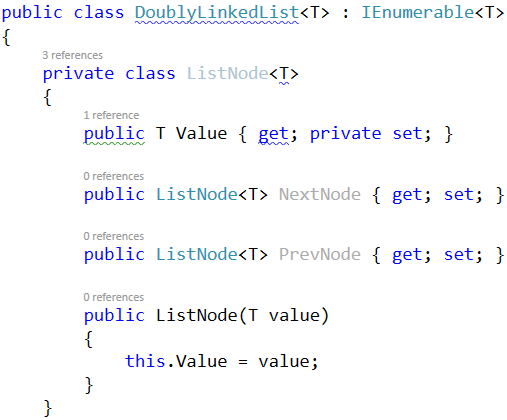
 
The class ListNode\<T> is called recursive data structure, because it references itself recursively. It uses the generic argument T to avoid later specialization for any data type, e.g. int, string or DateTime. The generic classes in C# work similarly to templates in C++ and generic types in Java.

### Implement Head, Tail and Count

Now, let's define the head and tail of the doubly linked list:

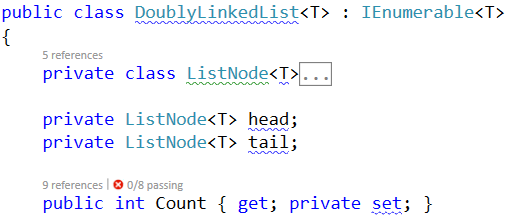

### Implement AddFirst(T) Method

Next, implement the AddFirst(T element) method:

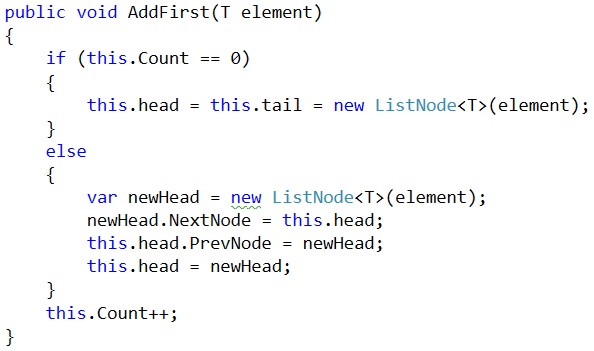
 
Adding an element at the start of the list (before its head) has two scenarios (considered in the above code):

- Empty list -> add the new element as head and tail in the same time.
- Non-empty list -> add the new element as new head and redirect the old head as second element, just after the new head.

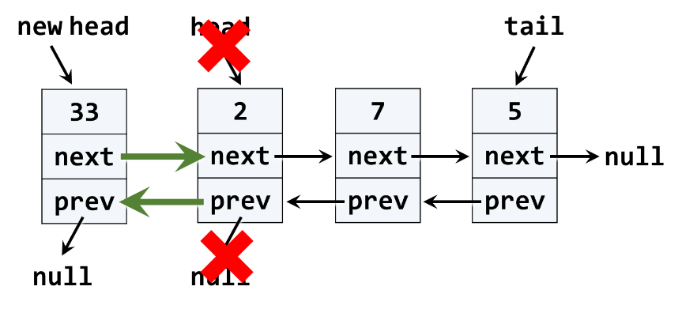

The above graphic visualizes the process of inserting a new node at the start (head) of the list. The red arrows denote the removed pointers from the old head. The green arrows denote the new pointers to the new head.

### Implement ForEach(Action) Method

We have a doubly linked list. We can add elements to it. But we cannot see what's inside, because the list still does not have a method to traverse its elements (pass through each of them, one by one). Now let's define the ForEach(Action\<T>) method. In programming such a method is known as "visitor" pattern. It takes as an argument a function (action) to be invoked for each of the elements of the list. The algorithm behind this method is simple: start from head and pass to the next element until the last element is reached (its next element is null). A sample implementation is given below:

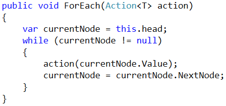

### Problem 9.	Run the Unit Tests

Now we have the methods AddFirst(T) and ForEach(Action\<T>). We are ready to run the unit tests to ensure they are correctly implemented. Most of the unit tests create a doubly linked list, add / remove elements from it and then check whether the elements in the list are as expected. For example, let's examine this unit test:

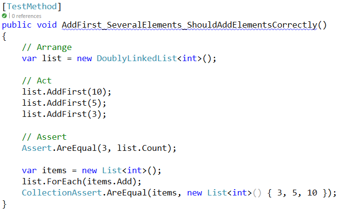
 
If we run the unit tests, some of them will now pass:

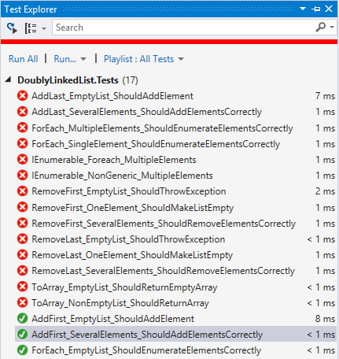
 
### Implement AddLast(T) Method

Next, implement the AddLast(T element) method for appending a new element as the list tail. It should be very similar to the AddFirst(T element) method. The logic inside it exactly the same, but we append the new element at the tail instead of at the head. The code below is intentionally blurred. Write it yourself!

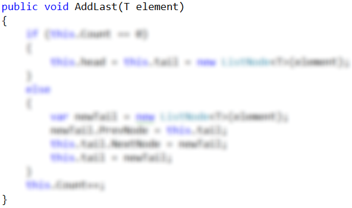
 
Now run the unit tests again. You should have several more passed (green) tests:

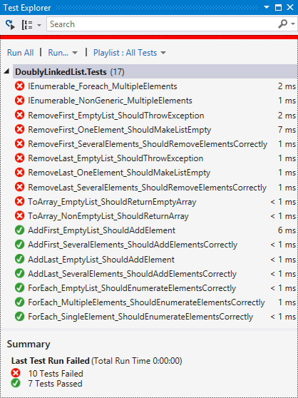

### Implement RemoveFirst() Method

Next, let's implement the method RemoveFirst() -> T. It should remove the first element from the list and move its head to point to the second element. The removed element should be returned as a result from the method. In case of empty list, the method should throw an exception. We have to consider the following three cases:

- Empty list -> throw and exception.
- Single element in the list -> make the list empty (head == tail == null).
- Multiple elements in the list -> remove the first element and redirect the head to point to the second element (head = head.NextNode).

A sample implementation of RemoveFirst() method is given below:

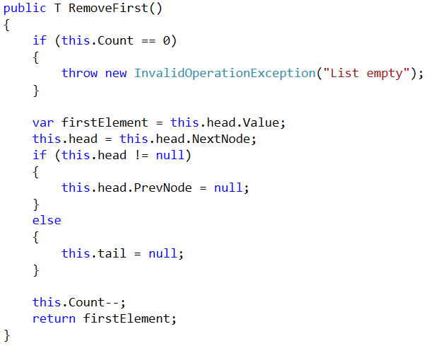
 
Run the unit tests to ensure the method is correctly implemented:

### Problem 10. Implement RemoveLast() Method

Next, let's implement the method RemoveLast() -> T. It should remove the last element from the list and move its tail to point to the element before the last. It is very similar to the method RemoveFirst(), so you are free to implement it yourself. The code below is intentionally blurred:

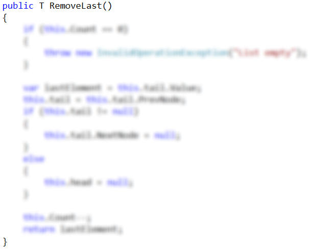

### Problem 11. Implement ToArray() Method

Now, implement the next method: ToArray() -> T[]. It should copy all elements of the linked list to an array of the same size. You could use the following steps to implement this method:

- Allocate an array T[] of size this.Count.
- Pass through all elements of the list (from head to tail) and fill them to T[0], T[1], …, T[Count-1].
- Return the array as result.

Write yourself the blurred code in the method ToArray():

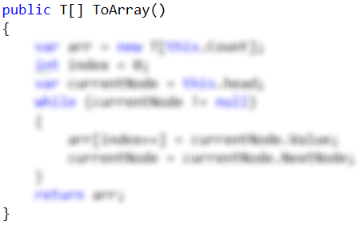

### Implement IEnumerable\<T>

Collection classes in C# and .NET Framework (like arrays, lists and sets) implement the system interface IEnumerable\<T> to enable the foreach iteration over their elements. The C# keyword foreach calls internally the following method:

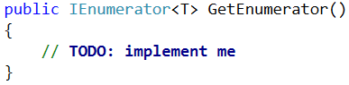

This method returns IEnumerator\<T>, which can move to the next element and read the current element. In programming, this is known as "iterator" pattern (enumerator).
We will use the "yield return" C# statement to simplify the implementation of the iterator:

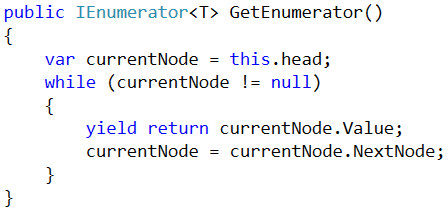

The above code will enable using the DoublyLinkedList\<T> in foreach loops.
The last unimplemented method is the non-generic enumerator:

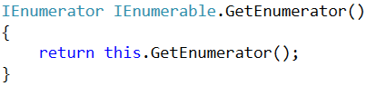

Finally, run the unit tests to ensure all of them pass correctly:

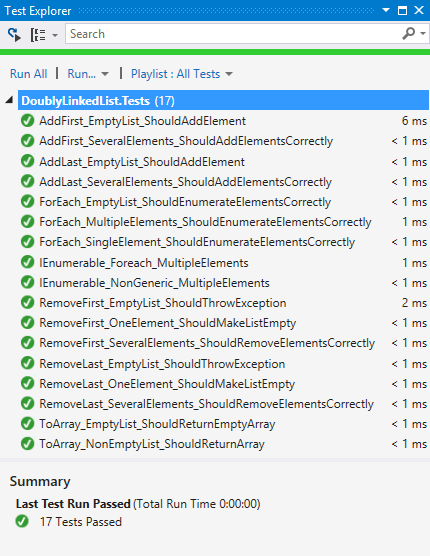

Congratulations! You have implemented your doubly linked list.

<b>Java Impelementation: <a href="./doublylinkedlist">Doubly Linked List</a></b>

<b>Document with tasks description: <a href="./01. Data-Structures-Linear-DS-Lists-and-Complexity-Homework.docx">01. Data-Structures-Linear-DS-Lists-and-Complexity-Homework.docx</a></b>

