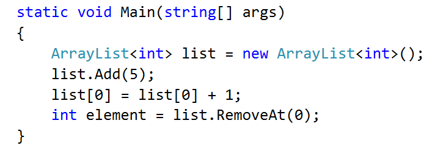
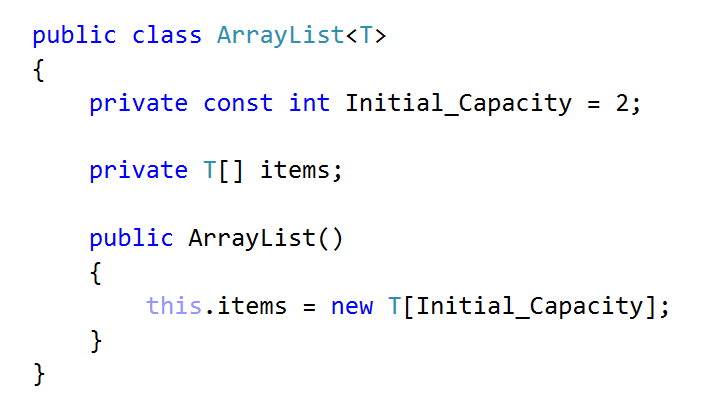
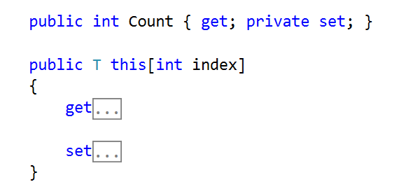
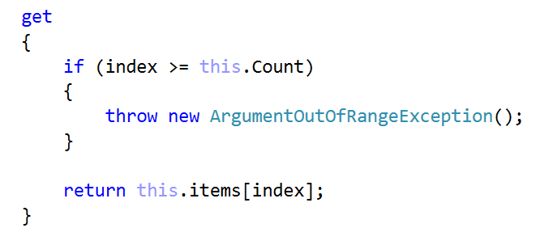
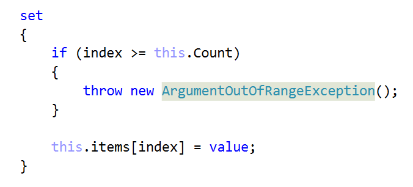
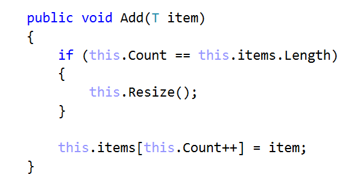
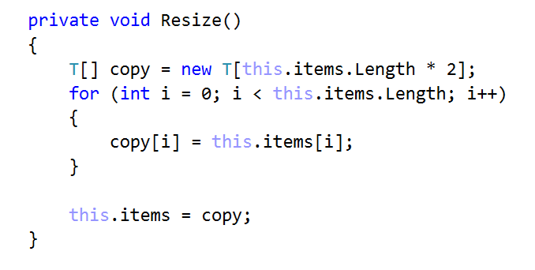
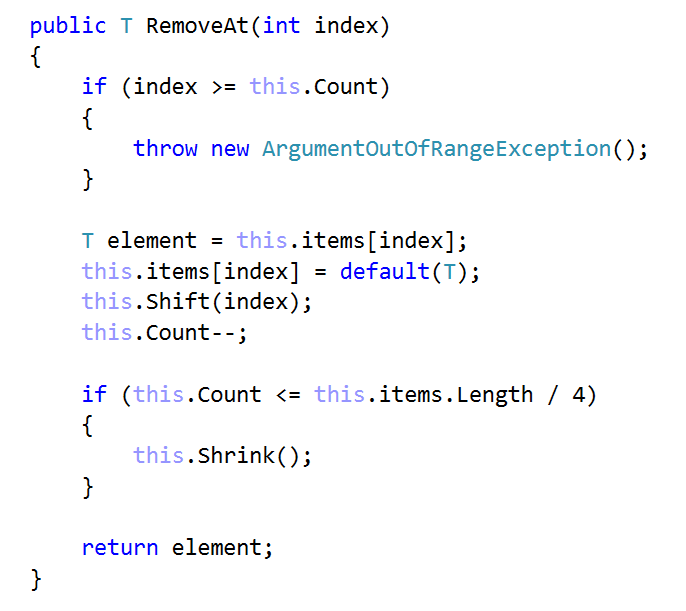
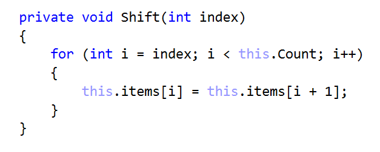
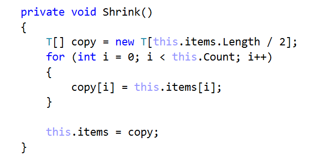

# **Lab: Linear Data Structures**

Problems for exercises and homework for the "Data Structures" course @ SoftUni.
You can check your solutions here: https://judge.softuni.bg/Contests/Compete/Index/550#0.

### **1. ArrayList<T>**

Implement a data structure ArrayList<T> that holds a sequence of elements of generic type T. It should hold a sequence of items in an array. The structure should have capacity that grows twice when it is filled, always starting at 2. The list should support the following operations:

- int Count -> returns the number of elements in the structure 
- T this[int index] -> the indexer should access the elements by index (in range 0 … Count-1) in the reverse order of adding
- void Add(T item) -> adds an element to the sequence (grow twice the underlying array to extend its capacity in case the capacity is full)
- T RemoveAt(int index) -> removes an element by index (in range 0 … Count-1) and returns the element

Be sure to test implemented operations whenever possible before moving to the next

### **Examples**

#### Solution

Declare the class ArrayList<T>

 
Start with Count and Indexer

 
Implement get by index

 
And set by index should be

 
Implement Add and Resize methods
 

 
Finally, implement RemoveAt, Shrink and Shift methods
 

<b>Solution: <a href="./arraylist">ArrayList</a></b>

