# Lab: Linear Data Structures

This document defines the in-class exercises assignments the "Data Structures" course @ Software University. You can submit your code in the SoftUni Judge System - https://judge.softuni.bg/Contests/574/Linear-Data-Structures-Stacks-and-Queues-Lab.

## LinkedList\<T>

Implement a data structure LinekdList\<T> that holds a sequence of elements of generic type T. It should hold a sequence of items in a sequence of linked nodes. The list should support the following operations:

- int Count -> returns the number of elements in the structure
- void AddFirst(T item) -> adds an element to the start of the sequence
- void AddLast(T item) -> adds an element to the end of the sequence
- T RemoveFirst() -> removes an element from the start of the sequence and returns the element
- T RemoveLast() -> removes an element from the end of the sequence and returns the element
- IEnumerable\<T> -> implement interface
  
RemoveFirst() and RemoveLast() methods should throw InvalidOperationException if the list is empty

### Examples

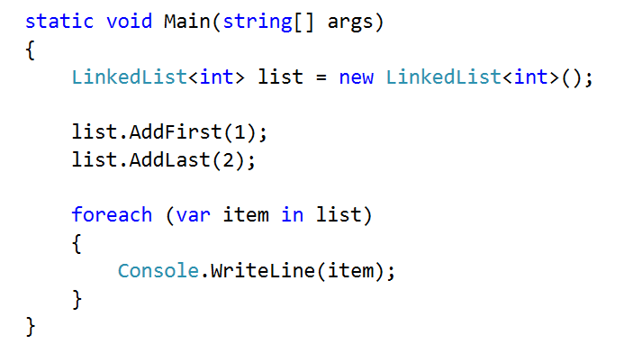

Solution
Start by defining the class LinkedList\<T>, you can define the Node class inside (in which case it doesn't need to be generic, as you will use T from the LinkedList)
Also, note that we are going to keep a reference to both the head and the tail of the list

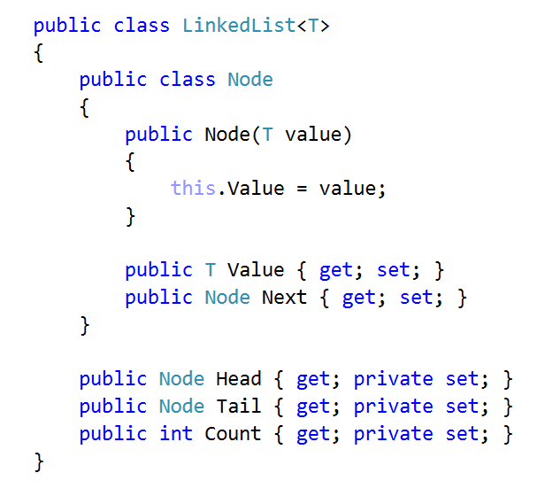

First, implement AddFirst(). The utility method IsEmpty() checks if the Count is 0

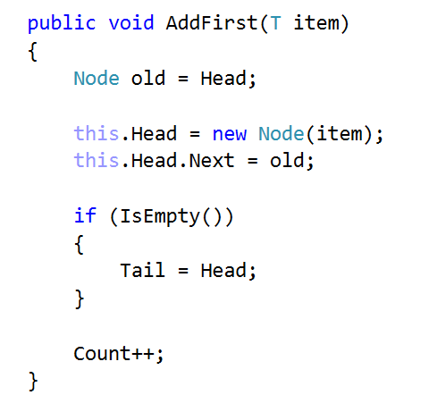

AddLast() is almost the same

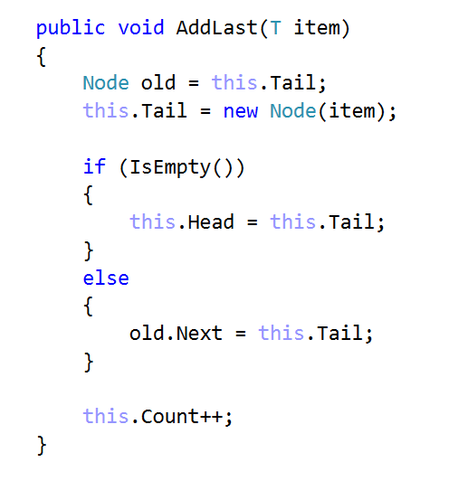

Remove methods are a little bit more complicated. Start with RemoveFirst()

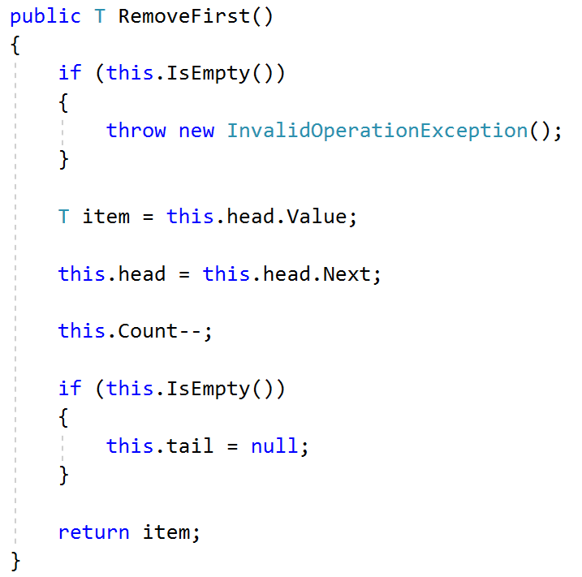

Method RemoveLast() uses a utility method GetSecondToLast() which gets the second to last element. Try to implement it yourself

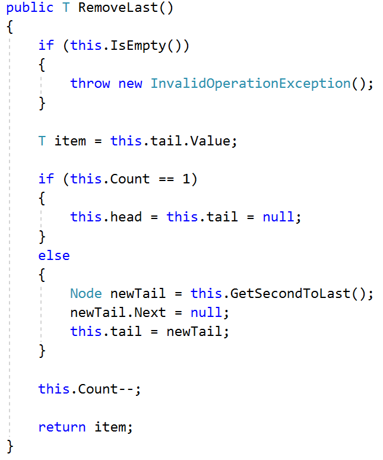

The last thing to do is to implement IEnumerable\<T>

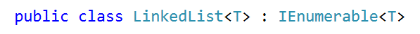

You need to implement two methods. The first is the actual that will do the work. The second one calls the first and you need it only for compatibility reasons

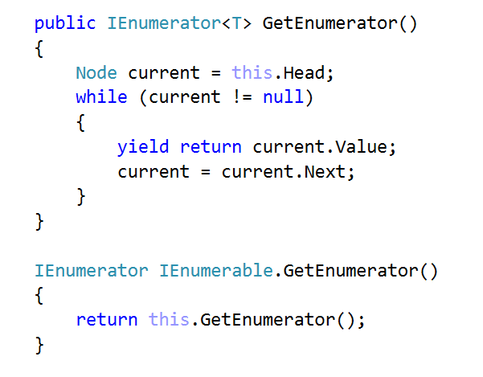

<b>Java Implementation: <a href="./linkedlist">Linked List</a></b>

<b>Document with tasks description: <a href="./02. Linear-Data-Structures-Stacks-and-Queues-Linked-List.docx">02. Linear-Data-Structures-Stacks-and-Queues-Linked-List.docx</a></b>

## Exercises: Implement Circular Queue

This document defines the in-class exercises assignments the "Data Structures" course @ Software University. You can submit your code in the SoftUni Judge System - https://judge.softuni.bg/Contests/574/Linear-Data-Structures-Stacks-and-Queues-Lab.

You have to implement an array-based circular queue in C# – a data structure that holds elements and follows FIFO (First In, First Out) behavior, with fixed internal capacity that doubles its size when filled:

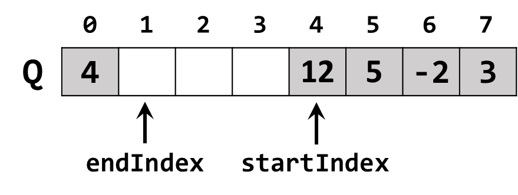

In the figure above, the queue elements {12, 5, -2, 3, 4} stay in an array with fixed capacity of 8. The queue capacity is 8, the elements count is 5 and 3 cells stay empty. The startIndex points the first non-empty element in the queue. The endIndex points just after the last non-empty element in the queue – the place where the next coming element will be enqueued. Note that the queue is circular: after the element at the last position 7 comes the element at the first position 0.

### Problem 1. Learn about Circular Queue in Wikipedia

Before starting, get familiar with the concept of circular queue: https://en.wikipedia.org/wiki/circular_buffer

The typical operations over a circular queue are enqueue / dequeue and get count. Let's start coding!

### Problem 2. CircularQueue\<T> – Project Skeleton

You are given a Visual Studio project skeleton (unfinished project) holding the unfinished CircularQueue\<T> class and unit tests for its functionality. The project holds the following assets:

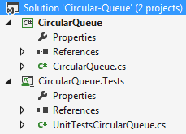

The project skeleton opens correctly in Visual Studio 2017 but can be open in other Visual Studio versions as well and also can run in SharpDevelop and Xamarin Studio.
The main class stays in the file CircularQueue.cs:

        public class CircularQueue<T>
        {
            private const int DefaultCapacity = 4;
            public int Count { get; private set; }
            public CircularQueue(int capacity = DefaultCapacity) { … }
            public void Enqueue(T element) { … }
            public T Dequeue() { … }
            public T[] ToArray() { … }
        }

The project comes with unit tests covering the entire functionality of the circular queue (see the class UnitTestsCircularQueue):

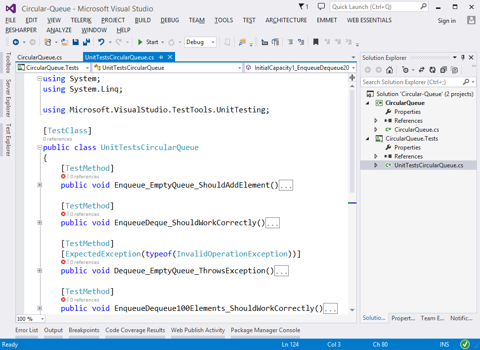

### Problem 3. Run the Unit Tests to Ensure All of Them Initially Fail

Run the unit tests from the CircularQueue.Tests project. Right click on the file "UnitTestsCircularQueue.cs" in Solution Explorer and select [Run Unit Tests]:

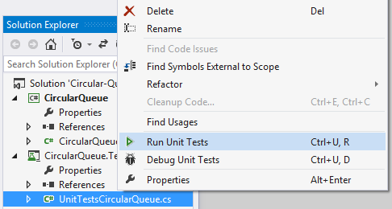

The results is like this:

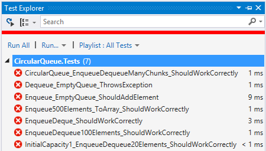

This is quite normal. We have unit tests, but the code covered by these tests is missing. Let's write it.

### Problem 4. Define the Queue Internal Data

The first step is to define the inner data that holds the queue elements and the start + end indexes:

- T[] elements – an array that holds the queue elements
  - Non-empty cells hold elements
  - Empty cells are free for adding new elements
  - The array Length holds the queue capacity
- int startIndex – holds the queue start index (the index of the first entered element in the queue)
- int endIndex – holds the queue end index (the index in the array that follows the last queue element)
- int Count – holds the number of elements in the queue

The code might look like this:

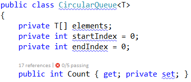

### Problem 5. Implement the Queue Constructor

Now, let's implement the queue constructor. Its purpose is to allocate the specified capacity of elements in the underlying array in the CircularQueue<T> class. The queue constructor has two forms:

- Parameterless constructor – should allocate 16 elements (16 is the default initial queue capacity)
- Constructor with parameter capacity – allocates the specified capacity in the underlying array

The code might look like the sample below (note that we have combined the above described two constructors in a single constructor through default parameter value). We also introduced the constant InitialCapacity to hold the initial queue capacity (16 elements):

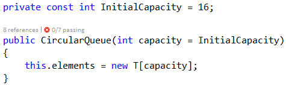

### Problem 6. Implement the Enqueue(…) Method

Now, we are ready to implement the Enqueue(element) method that appends a new element at the queue end:

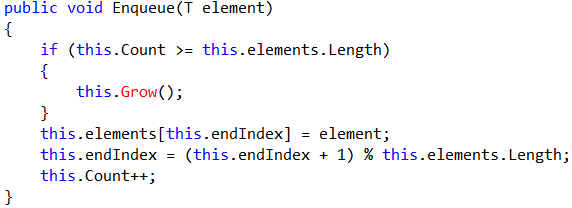

How it works? First, if the queue is full, grow it (resize its capacity to 2 times bigger capacity). Next, put the new element at position endIndex (the index, just after the last queue element) + move the end index to point the position on the right of it + increase the internal elements counter Count.
Note that the queue is circular, so the element after the last element (this.elements.Length-1) is 0.

Thus, we have a formula: the next element after p comes at position (p + 1) % capacity. In the code we have:

(this.endIndex + 1) % this.elements.Length

### Problem 7. Implement the Grow() Method

The Grow() method is called when the queue has filled its capacity (capacity == Count) and we are trying to add a new element. The Grow() method should allocate a new underlying array with doubled capacity and move all elements from the old array to the new array:

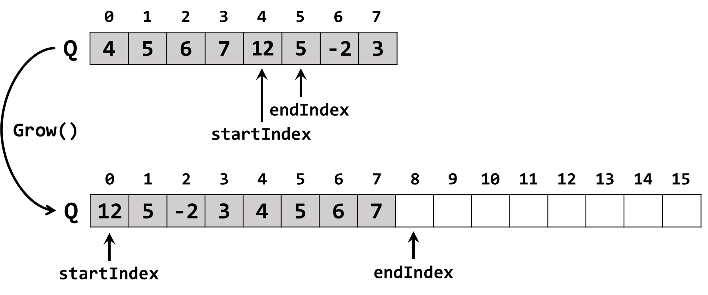

The code to grow the queue capacity might look like this:

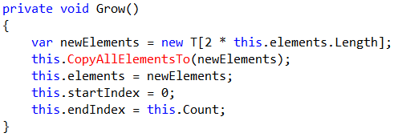

An important part of the "grow" process is to copy the old array elements to the new array. This might be implemented as follows:

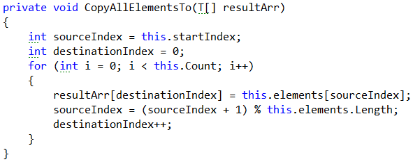

We use the already mentioned formula for the next element after sourceIndex:

nextIndex = (sourceIndex + 1) % capacity.

### Problem 8. Implement Dequeue() Method

Next comes the Dequeue() method. Its purpose is to return and remove from the queue its first added element (the element at position startIndex). The code might look as follows:

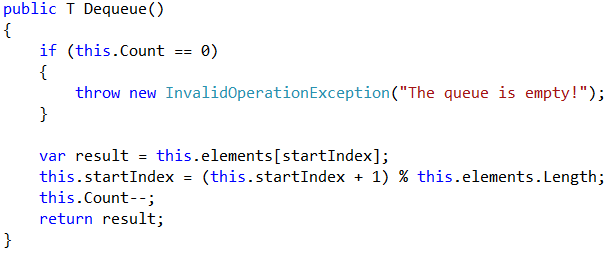

How it works? If the queue is empty, an exception is thrown. Otherwise, the first queue element is taken (the element at position startIndex); the startIndex is moved to its next position; the Count is decreased.
Again, we use the same formula for the next element after startIndex:

nextIndex = (startIndex + 1) % capacity.

### Problem 9. Run the Unit Tests

Now we have implemented the queue constructor, Enqueue(element) and Dequeue() methods. We are ready to run the unit tests to ensure they are correctly implemented. Most of the unit tests create a queue, enqueue / dequeue elements and then check whether the elements in the queue are as expected. For example, let's examine the following unit test:

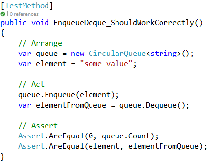

This unit test creates a queue of strings, add an element to the queue (enqueue), removes an element from the queue (dequeue) and checks whether the queue is empty at the end and the element from the queue is the same like the element added to the queue earlier.
If we run the unit tests, some of them will now pass and some of them will still fail:

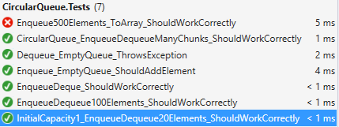

All tests, except the test for the unimplemented ToArray() method, pass successfully. We are almost done.

### Problem 10. Implement ToArray() Method

Next, implement the ToArray() method. It should allocate an array with capacity of this.Count and copy all queue elements to it. We already have a method to copy the queue element to an array, so the code will be very short and easy to write. The code below is intentionally blurred. Try to write it alone.

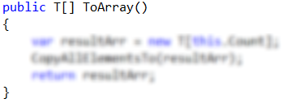

Now run the unit tests again. You should have all the tests passed (green):

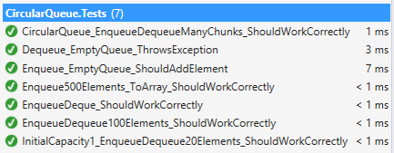

Congratulations! You have implemented your circular queue.

<b>Java Implementation: <a href="./circularqueue">Circular Queue</a></b>

<b>Document with tasks description: <a href="./02. Linear-Data-Structures-Stacks-and-Queues-Circular-Queue.docx">02. Linear-Data-Structures-Stacks-and-Queues-Circular-Queue.docx</a></b>

