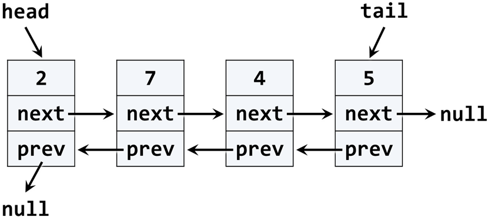

# Exercises: Linear Data Structures – Stacks and Queues

This document defines the exercise assignments for the "Data Structures" course @ Software University. You can submit your code in the SoftUni Judge System -

https://judge.softuni.bg/Contests/567/Linear-Data-Structures-Stacks-and-Queues-CSharp-Exercise

### Problem 1. Reverse Numbers with a Stack

Write a program that reads N integers from the console and reverses them using a stack. Use the Stack\<int> class from .NET Framework. Just put the input numbers in the stack and pop them. 

### Examples

<table>
<thead>
<tr>
<th>Input</th>
<th>Output</th>
</tr>
</thead>
<tbody>
<tr>
<td>1 2 3 4 5</td>
<td>5 4 3 2 1</td>
</tr>
<tr>
<td>1</td>
<td>1</td>
</tr>
<tr>
<td>(empty)</td>
<td>(empty)</td>
</tr>
<tr>
<td>1 -2</td>
<td>-2 1</td>
</tr>
</tbody>
</table>

<b>Solution: <a href="./task/src/Ex01ReverseNumbersWithStack.java">Ex01ReverseNumbersWithStack.java</a></b>

### Problem 2. Calculate Sequence with a Queue

We are given the following sequence of numbers:

- S1 = N
- S2 = S1 + 1
- S3 = 2*S1 + 1
- S4 = S1 + 2
- S5 = S2 + 1
- S6 = 2*S2 + 1
- S7 = S2 + 2
- ...

Using the Queue\<T> class, write a program to print its first 50 members for given N. Examples:

<table>
<thead>
<tr>
<th>Input</th>
<th>Output</th>
</tr>
</thead>
<tbody>
<tr>
<td>2</td>
<td>2, 3, 5, 4, 4, 7, 5, 6, 11, 7, 5, 9, 6, …</td>
</tr>
<tr>
<td>-1</td>
<td>-1, 0, -1, 1, 1, 1, 2, …</td>
</tr>
<tr>
<td>1000</td>
<td>1000, 1001, 2001, 1002, 1002, 2003, 1003, …</td>
</tr>
</tbody>
</table>

<b>Solution: <a href="./task/src/Ex02CalculateSequence.java">Ex02CalculateSequence.java</a></b>

### Problem 3. Implement an Array-Based Stack

Implement the "stack" data structure Stack\<T> that holds its elements in an array:

            public class ArrayStack<T>
            {
                private T[] elements;
                public int Count { get; private set; }
                private const int InitialCapacity = 16;
                public ArrayStack(int capacity = InitialCapacity) { … }
                public void Push(T element) { … }
                public T Pop() { … }
                public T[] ToArray() { … }
                private void Grow() { … }
            }

Follow the concepts from the CircularQueue<T> class from the exercises in class. The stack is simpler than the circular queue, so you will need to follow the same logic, but more simplified. Some hints:

- The stack capacity is this.elements.Length
- Keep the stack size (number of elements) in this.Count
- Push(element) just saves the element in elements[this.Count] and increases this.Count
- Push(element) should invoke Grow() in case of this.Count == this.elements.Length
- Pop() decreases this.Count and returns this.elements[this.Count]
- Grow() allocates a new array newElements of size 2 * this.elements.Length and copies the first this.Count elements from this.elements to newElements. Finally, assign this.elements = newElements
- ToArray() just creates and returns a sub-array of this.elements[0…this.Count-1]
- Pop() should throw InvalidOperationException (or IllegalArgumentException) if the stack is empty

<b><a href="./arraystack">Array Stack</a> implementation</b>

### Problem 4. Linked Stack

Implement a stack by a "linked list" as underlying data structure:

 
Use the following code as start:

        public class LinkedStack<T>
        {
            private Node<T> firstNode;
            public int Count { get; private set; }
            public void Push(T element) { … }
            public T Pop() { … }
            public T[] ToArray() { … }
            private class Node<T>
            {
                private T value;
                public Node<T> NextNode { get; set; }
                public Node(T value, Node<T> nextNode = null) { … }
            }
        }

The Push(element) operation should create a new Node<T> and put it as firstNode, followed by the old value of the firstNode, e.g. this.firstNode = new Node<T>(element, this.firstNode).
The Pop() operation should return the firstNode and replace it with firstNode.NextNode. If the stack is empty, it should throw InvalidOperationException.

<b><a href="./linkedstack">Linked Stack</a> implementation</b>

### Problem 5. Linked Queue

Implement a queue by a "doubly-linked list" as underlying data structure:

Use the following code as start:

        public class LinkedQueue<T>
        {
            public int Count { get; private set; }
            public void Enqueue(T element) { … }
            public T Dequeue() { … }
            public T[] ToArray() { … }

            private class QueueNode<T>
            {
                public T Value { get; private set; }
                public QueueNode<T> NextNode { get; set; }
                public QueueNode<T> PrevNode { get; set; }
            }
        }

You may modify and adjust the code from the DoublyLinkedList\<T> class from the last lesson. If the queue is empty, the Dequeue() should throw InvalidOperationException.

### Problem 6. \* Sequence N -> M

We are given numbers n and m, and the following operations:

- n -> n + 1
- n -> n + 2
- n -> n * 2

Write a program that finds the shortest sequence of operations from the list above that starts from n and finishes in m. If several shortest sequences exist, find the first one of them. Examples:

<table>
<thead>
<tr>
<th>Input</th>
<th>Output</th>
</tr>
</thead>
<tbody>
<tr>
<td>3 10</td>
<td>3 -> 5 -> 10</td>
</tr>
<tr>
<td>5 -5</td>
<td>(no solution)</td>
</tr>
<tr>
<td>10 30</td>
<td>10 -> 11 -> 13 -> 15 -> 30</td>
</tr>
</tbody>
</table>

Hint: use a queue and the following algorithm:

- create a queue of numbers
- queue <- n
- while (queue not empty)
  - queue  e
  - if (e < m)
    - queue -> e + 1
    - queue -> e + 2
    - queue -> e * 2
  - if (e == m) Print-Solution; exit

The above algorithm either will find a solution, or will find that it does not exist. It cannot print the numbers comprising the sequence n  m.
To print the sequence of steps to reach m, starting from n, you will need to keep the previous item as well. Instead using a queue of numbers, use a queue of items. Each item will keep a number and a pointer to the previous item. The algorithms changes like this:

Algorithm Find-Sequence (n, m):

- create a queue of items { value, previous item }
- queue -> { n, null }
- while (queue not empty)
  - queue -> item
  - if (item.value < m)
    - queue -> { item.value + 1, item }
    - queue -> { item.value + 2, item }
    - queue -> { item.value * 2, item }
- if (item.value == m) Print-Solution; exit

Algorithm Print-Solution (item):

- while (item not null)
- print item.value
- item = item.previous