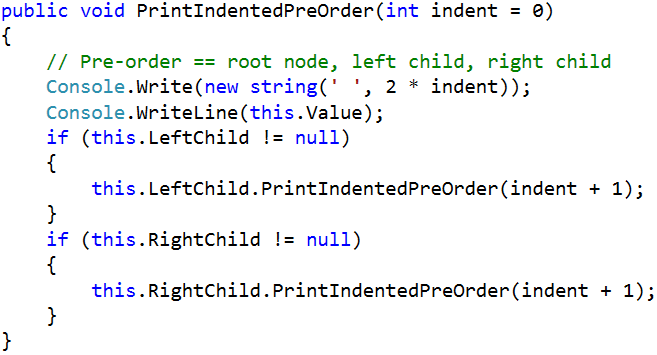
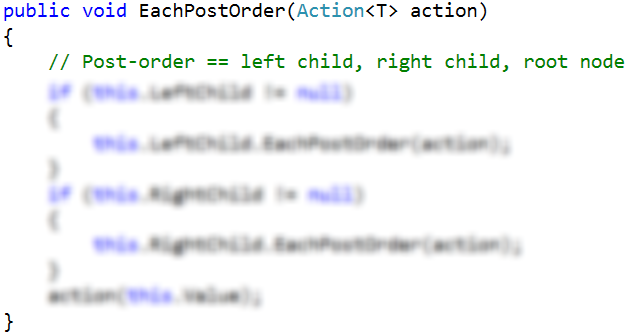

# Lab: Trees and Traversals

This document defines the in-class exercises assignments the "Data Structures" course @ Software University. You can submit your code in the SoftUni Judge System - https://judge.softuni.bg/Contests/571/Basic-Tree-Data-Structures-CSharp-Lab

## Part I – Implement a Tree

The first part of this lab aims to implement a tree (a node that holds a value and multiple child nodes) and traverse it recursively.

In the figure above, the tree nodes hold a value and a list of descendent tree nodes. It is recursive data structure.

### Problem 1. Trees – Project Skeleton

You are given a Visual Studio project skeleton (unfinished project) holding the unfinished Tree\<T> and BnaryTree\<T> classes and unit tests for their functionality. The project holds the following assets:

The project skeleton opens correctly in Visual Studio 2013 but can be open in other Visual Studio versions as well and also can run in SharpDevelop and Xamarin Studio.
The unfinished Tree\<T> class stays in the file Tree.cs:
Tree.cs

        public class Tree<T>
        {
            public Tree(T value, params Tree<T>[] children) { … }
            public void Print(int indent = 0) { … }
            public void Each(Action<T> action) { … }
        }

The unfinished BinaryTree\<T> class stays in the file BinaryTree.cs:
BinaryTree.cs

        public class BinaryTree<T>
        {
            public BinaryTree(T value, BinaryTree<T> leftChild = null,
                BinaryTree<T> rightChild = null) { … }
            public void PrintIndentedPreOrder(int indent = 0)  { … }
            public void EachInOrder(Action<T> action) { … }
            public void EachPostOrder(Action<T> action) { … }
        }
The project comes with unit tests covering the entire functionality of the trees (see the files UnitTestsTree.cs and UnitTestsBinaryTree.cs):

### Problem 2. Run the Unit Tests to Ensure All of Them Initially Fail

Run the unit tests from the Trees.Tests project. Open the "Test Explorer" window (Menu -> Test -> Windows -> Test Explorer) and run all tests. The expected behavior is that all tests should fail:

This is quite normal. We have unit tests, but the code covered by these tests is missing. Let's write it.

### Problem 3. Define the Tree\<T> Data Structure

The first step is to define the inner data hold tree nodes. It should hold the node value and a list of child nodes:

The source code might look like this:

### Problem 4. Define the Tree\<T> Constructor

The next step is to define a constructor for the Tree\<T> class to ensure you can create:

- Leaf tree nodes (holding a specified value) without child nodes, e.g.

- Internal tree nodes (holding a specified value) with child nodes, e.g.

You can use optional parameters for the child nodes to combine the above two constructors. A sample source code is shown below:

The parameter children is optional, so it could be passed or skipped. The goal is to allow creating trees by invoking nested constructors like these:

### Problem 5. Test the Tree\<T> Constructor

Now, test whether the Tree<T> and its constructor work as expected.

1. Use the debugger to set a breakpoint in the file PlayWithTrees.cs just after the tree construction.
2. Use the [Locals] debug window to browse the tree structure and the child nodes for each tree node.

### Problem 6. Define the Print() Method

Now, we need to implement the tree functionality. First, implement the Print() method. It works recursively:

- Prints the current node value (indented a few spaces on the right).
- Calls the Print() method recursively to print all child nodes of the current node.

The code might look like this:

### Problem 7. Test the Print() Method

To test the Print() method, run the unit tests. Some of them should pass successfully:

### Problem 8. Implement "For Each" Traversal

Now, implement the Each(Action\<T>) method that traverses the tree recursively from its root to its leaves and invokes the provided action function for each visited tree node. It works as follows:

- Process the current node value (invokes the action function on it).
- Calls the Each() method recursively to process all child nodes of the current node.

The source code might look as follows:

### Problem 9. Test the Each(Action\<T>) Method

To test the Each(Action\<T>) method, run the unit tests. All tests now should pass successfully:

The failed tests cover the BinaryTree\<T> class, which is still not implemented.
Congratulations! You have implemented your tree data structure.

<b>Java Impelementation: <a href="./binarytree">Tree</a></b>

## Part II – DFS and BFS

### DFS

Start by locating you Tree\<T>. Inside, define a method that will be visible from the client

The method should have a list in which it will gather the result, it will call a private method that will traverse the tree and finally return the result

Next, define the private method which will do the work and pass it the root of the tree and a reference to the resulting list

See if the tests pass

### BFS

For BFS we will need only one method that will do all the work with two collections, one for the algorithm and one for the result

Next, we need to enqueue the root node and then in a single loop, process the next node in the queue and add all of its children to the end of the queue

See if the BFS tests pass

## Part III – Implement a Binary Tree

The final part of this lab aims to implement a binary tree (a node that holds a value + left and right child nodes).

### Problem 10. Define the BinaryTree\<T> Data Structure

The first step is to define the inner data hold binary tree nodes. It should hold the node value + left and right child nodes (both of them are optional and can be null):

 
The source code might look like this:

### Problem 11. Define the BinaryTree\<T> Constructor

The next step is to define a constructor for the BinaryTree\<T> class to ensure you can create:

- Leaf tree nodes (holding a specified value) without child nodes, e.g.
  

- Internal tree nodes (holding a specified value) with left and right child nodes, e.g.

You can use optional parameters (holding null by default) for the child nodes to combine the above two constructors. A sample source code is shown below:

The parameters leftChild and rightChild are optional and can be passed or skipped. This will allow constructing binary tree like this:

### Problem 12. Test the BinaryTree\<T> Constructor

Now, test whether the BinaryTree\<T> and its constructor work as expected.
3. Use the debugger to set a breakpoint in the file PlayWithTrees.cs just after the binary tree construction.
4. Use the [Locals] debug window to browse the binary tree structure and the child nodes for each tree node (left and right child).

### Problem 13. Define the PrintIndentedPreOrder() Method

Now, we need to implement the binary tree functionality. First, implement the PrintIndentedPreOrder() method. It prints the tree in pre-order (root; left; right), indented visually like this:

The PrintIndentedPreOrder() method works recursively:

- Prints the current node value (indented a few spaces on the right).
- Calls the PrintIndentedPreOrder() method recursively to print the left child of the current node (when exists).
- Calls the PrintIndentedPreOrder() method recursively to print the right child of the current node (when exists).
  
The code might look like this:

### Problem 14. Test the PrintIndentedPreOrder() Method

To test the PrintIndentedPreOrder() method, run the unit tests. Some of them should pass successfully:

### Problem 15. Implement the EachInOrder(Action\<T>) Method

Next, let's implement the EachInOrder(Action\<T>) method that traverses the binary tree in in-order (left; root; right). It is again recursive, very similar to the previous method:

### Problem 16. Test the EachInOrder(Action\<T>) Method

To test the EachInOrder(Action\<T>) method, run the unit tests. One more test now should pass successfully:

### Problem 17. Implement the EachPostOrder(Action\<T>) Method

Next, let's implement the EachPostOrder(Action\<T>) method that traverses the binary tree in post-order (left; right; root). It is again recursive, very, very similar to the previous method:

### Problem 18. Test the EachPostOrder(Action\<T>) Method

To test the EachPostOrder(Action\<T>) method, run the unit tests. All tests should now pass successfully:

<b>Java Impelementation: <a href="./binarytree">Binary Tree</a></b>

<b>Document with tasks description: <a href="./03. Data-Structures-Basic-Trees-Lab.docx">03. Data-Structures-Basic-Trees-Lab.docx</a></b>

