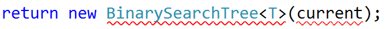

# Exercises: Implement Binary Search Tree

This document defines the in-class exercises assignments for the "Data Structures" course @ Software University. 
You can submit your code in the SoftUni Judge System - https://judge.softuni.bg/Contests/603/Binary-Search-Trees-CSharp-Lab

## Part I: Implement Insert, Contains and Search

The third part of this lab aims to implement a binary search tree (ordered binary tree).
Problem 1.	Define the Node Data Structure
First, you will need a node to store the data of each tree and a pointer to the root of the tree.

### Problem 2. Iteration

Implement the EachInOrder method, so you have a way to iterate over tree nodes

### Problem 3. Implement Contains

We will consider the non-recursive implementation. Start at the root and compare the searched value with the roots value. If the searched value is less it could be in the left subtree, if it is greater it could be in the right subtree:

### Problem 4. Implement Insert

Insert is very similar to Contains. Before traversing however, you should check if there are any elements in the tree. If not, set the root:

Next, traverse the tree, but hold reference to both current node and its parent

Finally, insert the new node:

### Problem 5. Implement Search

Search is very similar to Contains. First of all, it should return BinarySearchTree\<T>.

You will start by finding the element:

Now you only need to return the element you found:

In order for that to work, we need to implement a new private constructor:

Finally, you need to implement the Copy() method that will copy the elements in exactly the same way in which they exist in the parent tree (Pre-Order traversal):

### Problem 6. Run Unit Tests

Run the unit tests and ensure that some of them work correctly:

In the next parts, we will implement the rest of the methods.

## Part II: Implement  DeleteMin and Range

### Problem 7. Implement Delete Min

DeleteMin consists of three steps. Check if the root is null. If not, find the parent of the min element and set its left child to be the min's right child.
Check if root is not null

Find the min element's parent

If you found such a parent set its left child to be the min's right

### Problem 8. Implement Range

Range will be implemented using a queue of T. First, let's implement the public Range(T, T) 
method:

Now create a new method, that will take the Node and our queue as parameters:

We need to verify that our node is not null and this will be the bottom of our recursion. Now, we need to find if our node is in the lower and higher range borders:

Finally, we have to implement in-order traversal for the items that are in the range. Recursively go to the left if our node value is bigger than the lower range, and go to the right if our node value is smaller than the higher range border. If we found the element between the recursive calls, we need to add it to the queue:

### Problem 9. Run Unit Tests

Run the unit tests and ensure that all of them pass successfully.

That's it. You're ready to begin the exercise!

<b>Java Impelementation: <a href="./binarysearchtree">Binary Search Tree</a></b>

<b>Document with tasks description: <a href="./04. Data-Structures-Binary-Search-Trees-Lab.docx">04. Data-Structures-Binary-Search-Trees-Lab.docx</a></b>
