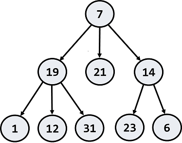

# Homework: Basic Tree Data Structures

This document defines the homework assignments for the "Data Structures" course @ Software University.

## Problem 0. Introduction

You are given a tree of N nodes represented as a set of N-1 pairs of nodes (parent node, child node). Below are the operations that you are going implement.

<table>
<thead>
<tr>
<th>Input</th>
<th>Output</th>
</tr>
</thead>
<tbody>
<tr>
<td>9 7 19 7 21 7 14 19 1 19 12 19 31 14 23 14 6 27 43</td>
<td>N = 9 Nodes: 7->19, 7->21, 7->14, 19->1, 19->12, 19->31, 14->23, 14->6 P = 27 S = 43</td>
<td></td>
<td>Root node: 7 Leaf nodes: 1, 6, 12, 21, 23, 31 Middle nodes: 14, 19 Leftmost deepest 
node: 1 Longest path: 7 -> 19 -> 1 (length = 3) Paths of sum 27: 7 -> 19 -> 1 7 -> 
14 -> 6 Subtrees of sum 43: 14 + 23 + 6</td>
</tr>
</tbody>
</table>

Problem 1.	Root Node
Write a program to read the tree and find its root node:
Input	Output	Tree
9
7 19
7 21
7 14
19 1
19 12
19 31
14 23
14 6	Root node: 7	 
Hints
Use the recursive Tree<T> definition. Keep the value, parent and children for each tree node:
 
Modify the Tree<T> constructor to assign a parent for each child node:
 
Use a dictionary to map nodes by their value. This will allow you to find the tree nodes during the tree construction (when you read the input data, you get the node values):
 
Write a method to find the tree node by its value or create a new node if it does not exist:
 
Create a method for adding an edge to the tree
 
Now you are ready to create the tree. You are given the tree edges (parent + child). Use the dictionary to lookup the parent and child nodes by their values:
 
Finally, you can find the root (the node that has no parent)
 
Problem 2.	Print Tree
Write a program to read the tree from the console and print it in the following format (each level indented +2 spaces):
Input	Output	Tree
9
7 19
7 21
7 14
19 1
19 12
19 31
14 23
14 6	7
  19
    1
    12
    31
  21
  14
    23
    6	 
Hints
Find the root and recursively print the tree
Problem 3.	Leaf Nodes
Write a program to read the tree and find all leaf nodes (in increasing order):
Input	Output	Tree
9
7 19
7 21
7 14
19 1
19 12
19 31
14 23
14 6	Leaf nodes: 1 6 12 21 23 31	 
Hints
Find the all nodes that have no children
Problem 4.	Middle Nodes
Write a program to read the tree and find all middle nodes (in increasing order):
Input	Output	Tree
9
7 19
7 21
7 14
19 1
19 12
19 31
14 23
14 6	Middle nodes: 14 19	 
Hints
 
Problem 5.	* Deepest Node
Write a program to read the tree and find its deepest node (leftmost):
Input	Output	Tree
9
7 19
7 21
7 14
19 1
19 12
19 31
14 23
14 6	Deepest node: 1	 
 
Problem 6.	Longest Path
Find the longest path in the tree (the leftmost if several paths have the same longest length)
Input	Output	Tree
9
7 19
7 21
7 14
19 1
19 12
19 31
14 23
14 6	Longest path: 7 19 1	 

Problem 7.	All Paths With a Given Sum
Find all paths in the tree with given sum of their nodes (from the leftmost to the rightmost)
Input	Output	Tree
9
7 19
7 21
7 14
19 1
19 12
19 31
14 23
14 6
27	Paths of sum 27:
7 19 1
7 14 6	 
Problem 8.	* All Subtrees With a Given Sum
Find all subtrees with given sum of their nodes (from the leftmost to the rightmost). Print subtrees in pre-order sequence
Input	Output	Tree
9
7 19
7 21
7 14
19 1
19 12
19 31
14 23
14 6
43	Subtrees of sum 43:
14 23 6	 

Exercises: Binary Search Trees
This document defines the exercise assignments for the "Data Structures" course @ Software University. You can submit your C# code in the SoftUni Judge System - https://judge.softuni.bg/Contests/604/Binary-Search-Trees-CSharp-Exercise. You can submit your Java code in the SoftUni Judge System - https://judge.softuni.bg/Contests/607/Binary-Search-Trees-Java-Exercise.
Implement BST Operations
You are given a skeleton, in which you will find implemented the following operations:
•	void Insert(T) – Recursive implementation
•	void EachInOrder(Action<T>) – In-Order traversal
•	bool Contains(T) – Iterative implementation
•	BST<T> Search(T) – Returns copy of the BST
•	IEnumerable<T> Range(T, T) – Returns collection with the elements found in the BST. Both borders are inclusive.
•	DeleteMin() – Deletes the smallest element in the tree. Throws exception if the tree is empty.
You will need to implement the rest of the operations, that are defined below:
C# Method	Java Method	Return Type	Exception C#/Java 
DeleteMax()	deleteMax()	void	C# - InvalidOperationException
Java -IllegalArgumentException
Count()	size()	int	
Rank(T)	rank(T)	int	
Select(int)	select(int)	T	C# - InvalidOperationException
Ceiling(T)	ceiling(T)	T	C# - InvalidOperationException
Floor(T)	floor(T)	T	C# - InvalidOperationException
Delete(T)	delete(T)	void	C# - InvalidOperationException
Java - IllegalArgumentException
Problem 1.	Delete Max
Implement a method which deletes the max element in a BST (Binary Search Tree). If the tree is empty it should throw exception. The logic is similar to the DeleteMin() method, but you need to traverse the tree to the right.
 

Problem 2.	Count
Implement a method which returns the count of elements in the BST. 
 
Hints
In order to implement the count, we will create a new field in our Node class:
 
Now we can create new method Count(Node), which will recursively find the count of elements:
 
If our current node is null, we will return 0. Otherwise, we will return the count of our current node:
 
Now we only have to modify our Insert() method. It will set the count of elements of our new node to the count of its children nodes plus itself:
 
Next, we need to find a way to update the recalculate the count for each node when DeleteMin() is invoked. One way would be to change the DeleteMin() implementation to be recursive:
 
What will happen if our tree is empty and we call DeleteMin()? Fix it. Our count is ready.

Problem 3.	Rank
Implement a method which returns the count of elements smaller than a given value. 
 
Hints
Create a new recursive method that will return 0 if the node is null:
 
Then, we need to compare the element with the value of the node we are currently looking at. If the element is smaller, we can go to the left. If its larger, we need to get the count of the left elements and go to the right. If we find the element, we will return the count of elements, smaller than it.
 
You can try it out, it should work as expected.
Problem 4.	Select
Implement a method which accepts a number (n) and returns the first element which has exactly n elements smaller than it. Use the logic from Count() and Rank() to implement it.
 
Problem 5.	Floor
Implement a method which finds (returns) the nearest smaller value than given in the BST. This operation is similar to DeleteMin().
 
Problem 6.	Ceiling
Implement a method which finds (returns) the nearest larger value than given in the BST. This operation is similar to Floor() and DeleteMax().
 
Problem 7.	Delete*
Implement a method which deletes a node with given value.
 
 

