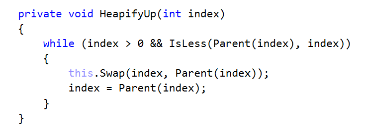
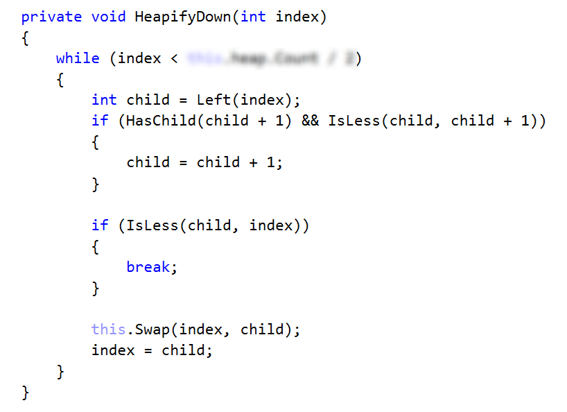

# Lab: Heaps and Priority Queues

This document defines the in-class exercises assignments the "Data Structures" course @ Software

### Problem 1. Max Binary Heap

You are given a skeleton. You should implement the following operations:

- int Count  returns the number of elements in the structure 
- void Insert(T item)  adds an element
- T Peek()  returns the maximum element without removing it
- T Pull()  removes and returns the maximum element
  
        public class BinaryHeap<T> where T : IComparable<T>
        {
            public BinaryHeap() { … }

            public int Count { … }
            public void Insert(T item) { … }
            public T Peek() { … }
            public T Pull() { … }
        }

### Examples

### Insert and Peek

First, you will need a container for all the elements. You can implement a resizing array yourself or even better, use the default implementation of your language: 

The count property should return the size of the underlying data structure

In a max heap, the max element should always stay at index 0. Peek should return that element, without removing it

Inserting an element should put it at the end and then bubble it up to its correct position. HeapifyUp receives as a parameter the index of the element that will bubble up towards the top of the pile.

Time to implement HeapifyUp. While the index is greater than 0 (the element has a parent) and is greater than its parent, swap child with parent. Implement the helper methods (Parent(), IsLess() and Swap()) by yourself.

Check if the tests for Insert() and peek() are passing

### Pull

First, check if there are elements in the heap

Next, we need to save the element on the top of the heap (index 0), swap the first and last elements, exclude the last element and demote the one at the top until it has correct position  

The HeapifyDown() function will demote the element at a given index until it has no children or it is greater than its both children. The first check will be our loop condition

<b>Java implementation: <a href="./maxbinaryheap">Max Binary Heap</a></b>

### Problem 2. Heap Sort

You are given a skeleton. Find the static class Heap and implement the following operation:

- void Sort(T[] array)-> performs an in-place sort of the given array in O(NlogN) time complexity

Elements should be sorted from smallest to largest.

### Example

### Solution

The Sort() function first builds the heap (first loop) and then finds correct position for each element (second loop)

You will need a modified version of the HeapifyDown() operation that receives the array and the border of unsorted/sorted elements

Check if all tests pass

Congratulations, you have completed the lab for Heaps and Priority Queues!

<b>Java implementation: <a href="./heapsort">Heap Sort</a></b>

<b>Document with tasks description: <a href="./05. Data-Structures-Heaps-Priority-Queues-Lab.docx">05. Data-Structures-Heaps-Priority-Queues-Lab.docx</a></b>
