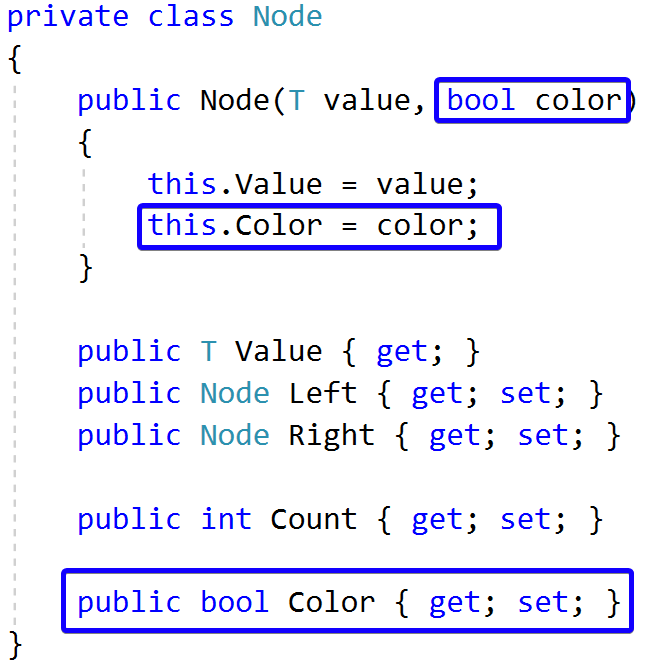
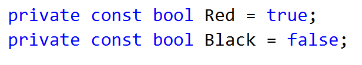
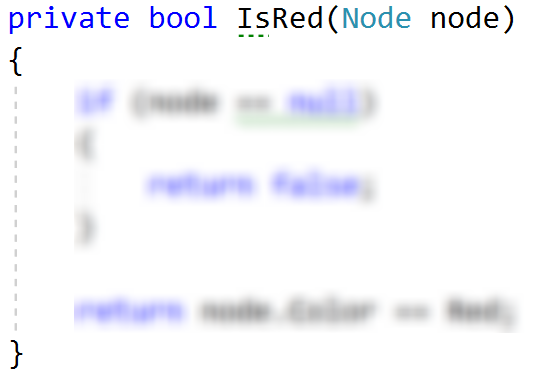
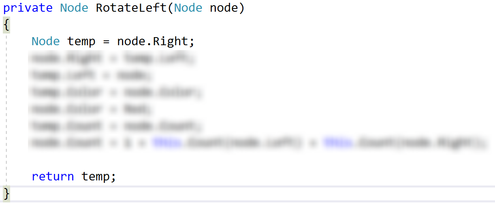
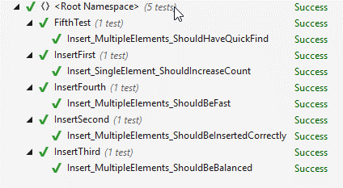

# Exercises: Implement Binary Search Tree

This document defines the in-class exercises assignments for the "Data Structures" course @ Software University.

This lab aims to implement the insertion functionality of a red-black binary search tree. You are given the skeleton of a fully implemented BST.

### Problem 1. Change the Node Data Structure

First, you will need to add a color bit to our node class:

### Problem 2. Check Red Node

Add the following constants to your RedBlackTree class:

Now create a helper method that will check if a node is red:

### Problem 3. Left Rotation

Create a method that will accomplish the left rotation for a given node.

Problem 4. Right Rotation

Create a method that will perform right rotation on a given node. The code is similar to the left rotation.

### Problem 5. Flip Colours

Implement a method that will make a node "black" and its children "red".

### Problem 6. Insert

Modify the existing insert() method. It should create new red node for every insert, balance the tree and recolour the nodes if needed.

### Problem 7. Run Unit Tests

That's it, you're ready to start implementing delete. :)

<b>Java implementation: <a href="./redblacktree">Red-Black Binary Search Tree</a></b>

<b>Document with tasks description: <a href="./06. Data-Structures-B-Trees-and-Red-Black-Trees-Lab.docx">06. Data-Structures-B-Trees-and-Red-Black-Trees-Lab.docx</a></b>
