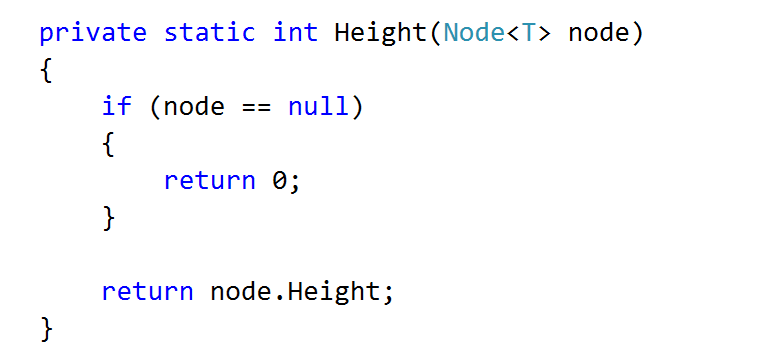
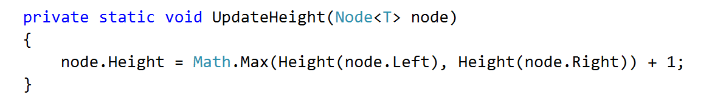
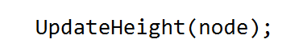
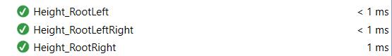
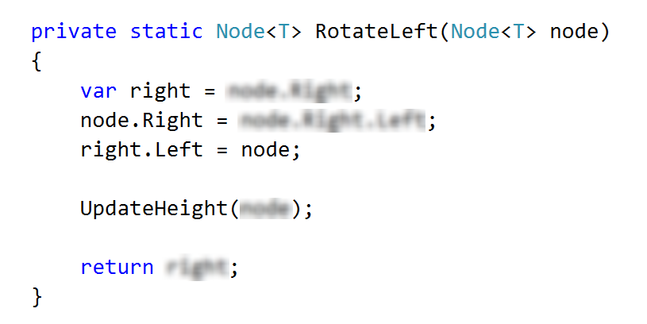
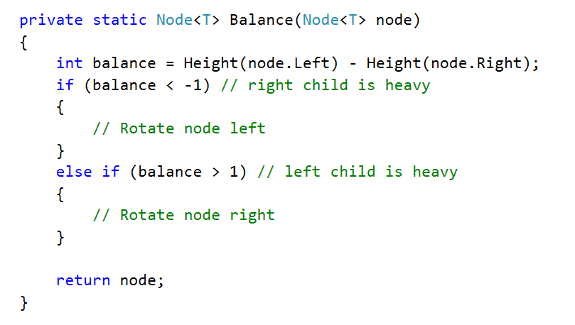
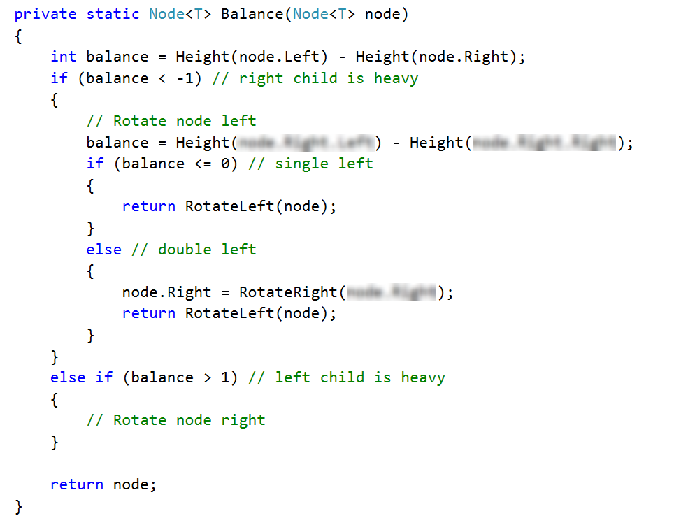
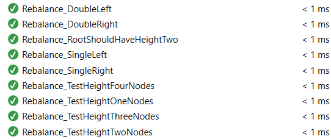

# Lab: AVL Tree Insertion

This document defines the in-class exercises assignments the "Data Structures" course @ Software University.

### Problem 1. AVL Tree Insertion

You are given a skeleton that supports the following operations:

- Node\<T> Root -> returns the root of the AVL tree
- bool Contains(T item) -> checks if an element exists
- void EachInOrder(Action\<T> action) -> performs an action in order on each element
- void Insert(T item) -> inserts an item into the tree

        public class AVL<T> where T : IComparable<T>
        {
            private Node<T> root;
            public Node<T> Root { get { return this.root; } }
            public bool Contains(T item) { … }
            public void Insert(T item) { … }
            public void EachInOrder(Action<T> action) { … }
        }

And a node class:

        public class Nodeь<T> where T : IComparable<T>
        {
            public T Value;
            public Node<T> Left;
            public Node<T> Right;
            public int Height;
            public Node(T value)
            {
                this.Value = value;
                this.Height = 1;
            }
        }

Your task is to balance the tree after each insertion.

### Height

First, you should update the height of all nodes along an insertion path
You will need a method to find a node's height

And a method to update a node's height

Consider when it is appropriate to update the height of a node

Check if Height tests pass

### Rotations

If you find it difficult to imagine the links that need to be updated in a rotation, refer to the presentation

The right rotation is analogous.

### Balancing

Start by creating the method

The first case (first if statement)

Right rotation is analogous to the left. Make sure that all tests pass:

Congratulations, you have completed the lab for AVL Trees.

<b>Java implementation: <a href="./avltree">AVL Tree</a></b>

<b>Document with tasks description: <a href="./07. Data-Structures-AVL-Trees-AA-Trees-Lab.docx">07. Data-Structures-AVL-Trees-AA-Trees-Lab.docx</a></b>
