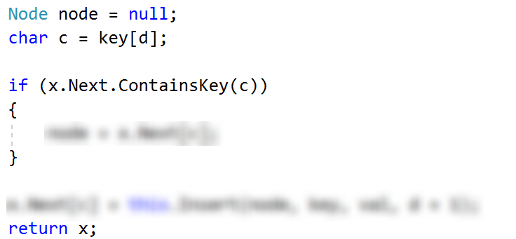

# Exercises: Implement Trie

This document defines the in-class exercises assignments for the "Data Structures" course @ Software University.

This lab aims to implement the insertion functionality of trie.

### Problem 1. Implement Insert

You're given a skeleton of a trie. You need to implement the insert() method, using the following recursive algorithm:

- Check if the given node is null and create and assign a new node if it is
- Check if you are at the last symbol of the key and if you are, do the following:
  - Make the node terminal
  - Assign the value
  - Return the node
- Check if the symbol you're at is in the children of the node
  - Move to the next node if it is
- Recursively call the insert for the next child of our node
- Return the node

### Hints

Here is the last part of the algorithm:

<b>Java implementation: <a href="./trie">Trie</a></b>

<b>Document with tasks description: <a href="./08. Data-Structures-Ropes-and-Tries-Lab.docx">08. Data-Structures-Ropes-and-Tries-Lab.docx</a></b>
