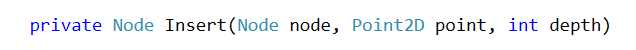

# **Lab: Interval Trees, K-d Trees**

This document defines the in-class exercises assignments the "Data Structures" course @ Software University. 

Submit your code in the SoftUni Judge - https://judge.softuni.bg/Contests/Practice/Index/644#0 

### **Problem 1.	Interval Tree**

You are given a skeleton. Implement the following operations:

- Interval SearchAny(int, int) -> returns any interval that intersects with a given lower and upper bound 
- IEnumerable<Interval> SearchAll(int, int) -> returns all intervals that intersect the given lower and upper bound

        public class IntervalTree
        {
            private Node root;
        
            public void Insert(double start, double end) { … }
        
            public Interval SearchAny(double start, double end) { … }
        
            public IEnumerable<Interval> SearchAll(double start, double end) { … }
        }
   
#### Solution

You will need to update the max endpoint whenever you insert (or delete/balance) a node

 
GetMax() returns the node that has greater max endpoint, while guarding against null values

 
Search for any interval that intersects given bounds

 
Searching for all intervals will do a recursive DFS, so you will need one method to call the recursion

 
And the actual DFS

<b>Implementation: <a href="./intervaltree">Interval Tree</a></b>

### **Problem 2. K-d Tree**

You are given a skeleton. Implement the following operations: 

- void Insert(Point2D) -> inserts a point into the tree 
- bool Contains(Point2D) -> shows if the tree contains a given point

    public class KdTree
    {
        private Node root;
    
        public void Insert(Point2D point) { … }
    
        public bool Contains(Point2D point) { … }
    
        public void EachInOrder(Action<Point2D> action) { … }
    }

#### Solution

The only thing different than a regular BST is the comparison. Create a method that will compare the point in a node and a second point, depending on the node depth

 
The other thing to consider is to pass the depth of a node when attemting to insert or search for a point
 

<b>Implementation: <a href="./kdtree">K-d Tree</a></b>

<b>Document with tasks description: <a href="./09. Data-Structures-Kd-Trees-Interval-Trees-Lab.docx">09. Data-Structures-Kd-Trees-Interval-Trees-Lab.docx"</a></b>

