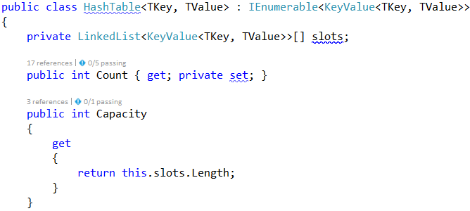
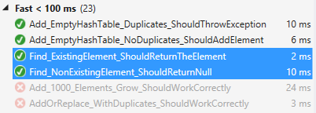

# Exercises: Implement Hash Table with Chaining

This document defines the in-class exercises assignments for the "Data Structures" course @ Software University. 

You must implement a hash table that uses chaining in a linked list as collision resolution strategy:

The hash table will hold its elements (key-value pairs) in a class KeyValue\<TKey, TValue>. The hash table will consist of slots, each holding a linked list of key-value pairs: LinkedList\<KeyValue\<TKey, TValue>>.

### Problem 1. Learn about Hash Tables in Wikipedia

Before starting, get familiar with the concept of hash table: https://en.wikipedia.org/wiki/Hash_table. Note that there are many collision resolution strategies like chaining and open addressing. We will use one of the simplest strategies: chaining elements with collisions in a linked list.
The typical operations over a hash table are add or replace, find and remove. Additional operations are enumerate all elements, enumerate all keys, enumerate all values and get count. Let's start coding!

### Problem 2. HashTable<TKey, TValue> – Project Skeleton

You are given a Visual Studio project skeleton (unfinished project) holding the class KeyValue\<TKey, TValue>, the unfinished class HashTable\<TKey, TValue> and unit tests for its entire functionality. The project holds the following assets:

Your goal is to implement the missing functionality to finish the project.
First, let's look at the KeyValue\<TKey, TValue> class. It holds a key-value pair of parameterized types TKey and TValue. To enable comparing key-value pairs, the class implements Equals(…) and GetHashCode(). It also has ToString() method to enable printing it on the console and view it inside the Visual Studio debugger. Note that this class is different than the .NET structure System.Collections.Generic.KeyValuePair\<TKey, TValue>. First, our class is mutable (can modify the key and value), and second, it is class, not structure, so it can have a null value (missing value). The KeyValue\<TKey, TValue> class comes out-of-the-box with the project skeleton, so you will not need to change it:

The project comes also with unit tests covering the entire functionality of the hash table (see the class UnitTestsHashTable):

### Problem 3. Run the Unit Tests to Ensure All of Them Initially Fail

Run the unit tests from the HashTable.Tests project. All of them should fail:

This is quite normal. We have unit tests, but the code covered by these tests is missing. Let's write it.

### Problem 4. Define the Hash Table Internal Data

The first step is to define the inner data that holds the hash table elements:

- LinkedList\<KeyValue\<TKey, TValue>>[] slots – an array that holds the slots in the hash table
  - Each slot is either empty (null) or holds a linked list of elements with the same hash code
- int Count – holds the number of elements in the hash table
- int Capacity – holds the number of slots in the hash table
- Thus, the hash table fill factor can be calculated by Count / Capacity

The code might look like this:

### Problem 5. Implement the Hash Table Constructor

Now, let's implement the hash table constructor. Its purpose is to allocate the slots that will hold the hash table elements. The hash table constructor has two forms:

- Parameterless constructor – should allocate 16 slots (16 is the default initial hash table capacity)
- Constructor with parameter capacity – allocates the specified capacity in the underlying array (slots)

The code might look like the sample below (note that we have combined the above described two constructors in a single constructor through а default parameter value). We also introduced the constant InitialCapacity to hold the initial hash table capacity (16 elements):

### Problem 6.	Implement the Add(key, value) Method

Now, we are ready to implement the most important method Add(key, value) that inserts a new element in the hash table. It should take into account several things:

- Detect collisions and resolve them through chaining the elements in a linked list.
- Detect duplicated keys and throw an exception.
- Grow the hash table if needed (resize to double capacity when the fill factor is too high).

The Add(key, value) method might look like this:

How it works? First, if the hash table is full, grow it (resize its capacity to 2 times bigger capacity). This will be discussed later. We can leave the GrowIfNeeded() method empty:

Next, find the slot that should hold the element to be added. The slot number is calculated by the hash value of the key. Typically, the GetHashCode() method from System.Object class in .NET framework provides hash codes calculation for the built-in types as well as for the custom types. It returns arbitrary 32-bit number. We need a number in the range [0 … size-1] so we take the modulus of the hash code:

We take the absolute value because GetHashCode() sometimes return negative numbers.
Once we have the slot number, it is either empty (null) or holds a linked list of elements with the same hash code like the new element. In both cases, we should have in the target slot a linked list holding the elements with the same hash value like the key.
We check for duplicated key and throw an exception if the same key already exists. Then we append the new element at the end of the linked list in the target slot of the hash table and increase 
this.Count.

### Problem 7. Run the Unit Tests

It is too early, but let's run the unit tests. We will have one test passed:

To have more tests passed, we need to implement the enumerator that return all hash table elements.

### Problem 8. Implement the Enumerator (IEnumerable\<T>)

Now let's implement the enumerator: a method that passed through all elements in the hash table exactly once. In C# and .NET Framework this is achieved by implementing the IEnumerable\<T> interface. The hash table holds key-value pairs (KeyValue<TKey, TValue>) elements, so we need to implement the interface IEnumerable<KeyValue<TKey, TValue>>. It holds two methods:

 
The first method calls the second. The second does the job: it passes through all slots and through all elements in the linked list in each slot and returns the elements in a sequence (as a stream). It uses the yield return construct in C# (generator function) to return the elements "on demand" upon request. Learn more about generator functions and yield return from Wikipedia: https://en.wikipedia.org/wiki/Generator_(computer_programming).

### Problem 9. Run the Unit Tests Again

Now let's run the unit tests again. We will have passed the tests for the Add(key, value) operation:

To have more tests passed, we need to implement the other hash table operations.

### Problem 10. Implement Find(key)

Let's implement the second most important operation after adding a key-value pair – finding an element by key. The Find(key) method should either return the element by its key or return null if the key does not exist:

The above code works as follows:

1. Finds the slot holding the specified key (by calculating the hash code modulus the hash table size).
2. Passes through all elements in the target slot (in its linked list) and compare their key with the target key.

Note: the code is intentionally unfinished. Fix the TODOs yourself.

### Problem 11. Run the Unit Tests Again

Run the unit tests again to check whether Find(key) works as expected. Two more tests should pass:

#### Problem 12. Implement Get(key), TryGetValue(key, out value) and ContainsKey(key) Methods

Once we have the Find(key) method, it is easy to implement the methods that directly depend on it:

- Get(key) – returns the element by given key or throws and exception when the key does not exist
- TryGetValue(key, out value) – conditional find by key
  - Returns true + the value if the ey exists in the hash table
  - Returns false if the key does not exist in the hash table
- ContainsKey(key) – returns whether the key exists in the hash table

Let's start with the Get(key) method:

Implement the TryGetValue(key, out value) method in similar way:

Notes:

- The code above is intentionally blurred. Implement it yourself!
- The method should always return a value in the value parameter. It is output parameter. The C# compiler will not allow you to leave it untouched. Use the expression default(TValue) when you need to return a neutral value of type TValue (null for classes or 0 for numbers).

The ContainsKey(key) method is trivial. Implement it yourself:

### Problem 13. Run the Unit Tests Again

Run the unit tests again to check whether the new methods work as expected. Several more tests should pass:

### Problem 14. Implement the GrowIfNeeded() and Grow() Methods

The GrowIfNeeded() method check whether the hash table should grow. The hash table should grow when it has filled its capacity to more than 75% (load factor > 75%) and we are trying to add a new element. In this case, it first calls Grow(), otherwise does nothing:

The Grow() method allocates a new hash table with double capacity and adds the old elements in the new hash table, then replaces the old hash table with the new one:

The code might look like this:

### Problem 15. Run the Unit Tests Again

Run the unit tests again to check whether the methods testing the "grow" functionality work as expected:

### Problem 16. Implement AddOrReplace(key, value)

The method AddOrReplace(key, value) is very similar to the Add(key, value) method. The only difference is the Add(key, value) throws and exception when the key is found to already exist in the hash table, while in the same situation AddOrReplace(key, value) replaces the value in the element holding the key, with the new value passed as argument.
Hint: copy / paste the code from Add(key, value) and slightly modify its logic.

Implement AddOrReplace(key, value) yourself. The code below is intentionally blurred:

### Problem 17. Run the Unit Tests Again

Run the unit tests again to check whether the "add or replace" functionality work as expected:

### Problem 18. Indexer this[key]

Now we are ready to implement the indexer this\[key]. It is a special method that accesses the hash table indexed by key. It does two things:

- get by key – returns the value by given key or exception when the key is not found.
- get a value by key – adds or replace the value by given key.
We already have methods Get(key) and AddOrReplace(key, value), so the indexer becomes is trivial:

### Problem 19. Run the Unit Tests Again

Run the unit tests again to check whether the "indexer" functionality work as expected:

### Problem 20. Implement Remove(key)

The next important functionality waiting to be implemented is removing an element by its key. The method Remove(key) should either:

- Successfully remove the element (when the key exists) from the hash table and return true.
- Return false when the key does not exist in the hash table.

The Remove(key) method is not trivial. It should first find the slot that is expected to hold the key, then traverse the linked list from its first to its last element and remove the element is case the key is found and return truе. Otherwise, it should return false:

### Problem 21. Run the Unit Tests Again

Now run the unit tests again to check whether the "remove" functionality works as expected:

### Problem 22. Implement Clear()

The Clear() method is trivial. It should reinitialize this.slots and this.Count, like it was initially done in the hash table constructor. Implement it yourself:

### Problem 23. Implement Keys and Values

Now implement the last piece of missing functionality: enumerating all keys and values. You can use LINQ extension method to select the keys / values from all hash table elements. We already have enumerator that returns all elements from the hash table. We just need to filter (select) the keys / values:

### Problem 24. Run the Unit Tests (Finally)

Now run the unit tests again (for the last time). You should have all the tests passed (green):

Congratulations! You have implemented your hash table with chaining.

<b>Java implementation: <a href="./hashtable">Hash Table</a></b>

<b>Document with tasks description: <a href="./10. Data-Structures-Hash-Tables-Sets-and-Dictionaries-Lab.docx">10. Data-Structures-Hash-Tables-Sets-and-Dictionaries-Lab.docx</a></b>
