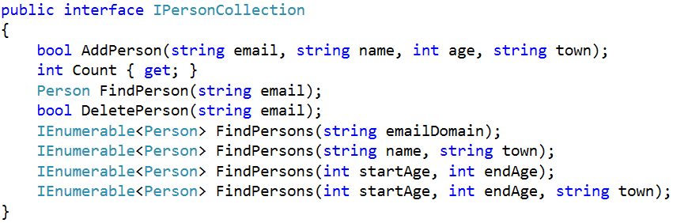
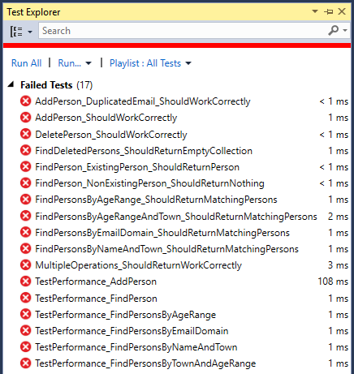
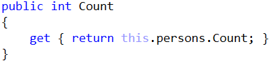

# Lab: Collection of Persons

This document defines the in-class exercises assignments for the "Data Structures" course @ Software University. We want to implement a “collection of persons” data structure that performs fast enough the following operations:

- Add-Person(email, name, age, town)
  - The email is unique (it uniquely identities the person)
  - If the email already exists returns false (without adding the person), otherwise return true
- Find-Person(email)
  - Returns the Person object or null (if it does not exits)
- Delete-Person(email)
  - Returns true (successfully deleted) or false (not found)
- Find-People(email_domain)
  - Returns a sequence of matched persons sorted by email
- Find-People(name, town)
  - Returns a sequence of matched persons sorted by email
- Find-People(start_age, end_age)
  - Returns a sequence of matched persons sorted by age, then by email (as second criteria)
- Find-People(start_age, end_age, town)
  - Returns a sequence of matched persons sorted by age, then by email (as second criteria)

### Problem 1. Collection of Persons – Project Skeleton

We are given a Visual Studio project skeleton (unfinished project) holding the unfinished classes Person, PersonCollection and PersonCollectionSlow and unit tests covering the functionality of the “person collection” data structure. The project holds the following assets:

The project skeleton opens correctly in Visual Studio 2013 but can be open in other Visual Studio versions as well and also can run in SharpDevelop and Xamarin Studio. Our goal is to implement the missing functionality in order to finish the project.

First, let's take a look at the Person class. We may need to finish it later:

Next, let’s look at the interface IPersonCollection. It defines the operations (methods and properties) to be implemented by the “person collection” data structure:

The next two classes PersonCollection and PersonCollectionSlow hold unfinished implementations of the IPersonCollection interface. These classes will be used to implement the data structure in two different ways – with list of persons (simple but slow implementation) and by several dictionaries (efficient implementation):

The project comes also with unit tests and performance tests covering the functionality of the “person collection” data structure (see the classes UnitTestsPersonCollection and PerformanceTestsPersonCollection):

### Problem 2. Run the Unit Tests to Ensure All of Them Initially Fail

Run the unit tests from the Collection-of-Persons.Tests project. All of them should fail:

This is absolutely normal. We have unit tests, but the code covered by these tests is missing. Let's write it.

### Problem 3. Start with a Straightforward (and Slow) Solution

First, let’s start with a simple, straightforward (and slow) solution – implement the “person collection” data structure as List\<Person>:

The finder methods could be implemented by LINQ queries with straightforward filtering and sorting using lambda expressions. First, let’s define the AddPerson(…) method:

It just creates a new person and appends it to the underlying list. It still does not check for existing person.
Next, let’s add the Count, FindPerson(email) and DeletePerson(email) methods that work over the underlying list-based collection of persons:

Problem 4.	Setup the Unit Tests
Now run the unit tests to test the slow list-based implementation of the “collection of persons” data structure. First, configure the test classes (UnitTestsPersonCollection and PerformanceTestsPersonCollection) to use the PersonCollectionSlow implementation of the IPersonCollection interface:
 
 
Problem 5.	Run the Unit Tests
Now run the unit tests. We should have five tests passed:
 
This is expected. Most functionality is still unimplemented. The “person collection” implementation works partially.
Problem 6.	Finder Methods in the Slow Solution
Now, let’s continue by implementing the finder methods in the slow list-based implementation.
First, implement finding persons by email domain. The results should be sorted by email:
 
Similarly, implement the other finder methods. Finding persons by name and town works the same way like finding by email domain:
 
Finding persons by age range works by simple filtering the underlying list of persons, then by applying the requested sorting order (sort first by age, then by email as second criteria):
 
Finally, we implement finding by age range and town, just like the previous finder methods:
 
All “person collection” functionality seems to be implemented. 
Problem 7.	Run the Unit Tests Again
Now, let’s run again the unit tests and the performance tests to check whether the implementation works as expected. Some tests pass:
 
And some tests fail:
 
Analysing the failed tests, we could make two conclusions:
•	Adding a person with duplicated email does not work correctly.
•	Most performance tests fail, so the algorithm is most probably inefficient.
Problem 8.	Fix the AddPerson(…) Method
Let’s fix the first bug. When a person is added and its email already exists, the method should return false without modifying the underlying data structures:
 
This will fix the bug in the AddPerson(…) method but could make it run slower, because now it performs search before adding a new person. If the FindPerson(…) methods is slow, the AddPerson(…) will be slow as well.
Problem 9.	Run the Unit Tests Again
Now let’s run the tests after the fix in the AddPerson(…) method.
Some tests are expected to pass and some to fail:
 
The test execution results above show that the entire functionality works correctly, but the performance is not good. The conclusion is that the list-based implementation of “person collection” is correct but slow.
Problem 10.	More Efficient Underlying Data Structures
Now let’s implement an improved solution, which uses more efficient underlying data structures.
Let’s first define the data structures needed to perform efficiently the required operations:
•	To find a person by email we can use a hash-table. We expect zero or one person to match given email address (recall that the email is unique):
 
•	To find all persons matching given email address domain, we can use a hash-table. It will use the email domain as key and a sorted set of persons as value:
 
	Note that persons for each email domain are sorted internally by email. In order this to work correctly, the Person class should implement IComparable<Person> and compare persons by their email:
 
•	To find all persons by name and town we can use a hash-table. We can combine the name + town as a single string value and use it as key and use sorted set of persons as value:
 
•	Finding all persons by age range needs a data structure that uses the age as key and keeps the ages sorted. The values could be a sorted set of persons (sorted by email):
 
In the above structure, when we look for all persons by range of ages, we will get all distinct ages in increasing order and for each age we will get a set of persons sorted by email.
•	Finding in a fast way all persons matching certain town and certain range of ages is more complicated. We need double mapping: first map towns to some structure, which maps ages to sets of persons. For example, we could have a dictionary that maps towns to sorted dictionary:
 
In the above structure, when we look for all persons by town and a range of ages, we will first lookup to find the dictionary of ages for given town, then will get all distinct ages in the specified range in increasing order and finally for each age we will get a set of persons sorted by email.
We have five separate data structures that work together to implement efficiently the operations from the “person collection” data structure. When we use a combination of data structures we need to always keep all underlying data structures up to date:
•	Add needs to add the new data to all underlying data structures.
•	Modify needs to update all the underlying data structures to hold correct data.
•	Delete needs to delete the data from all underlying data structures.
We are ready to implement the operations from the IPersonCollection interface based on the above underlying data structures. Let’s do it.
Problem 11.	Implement Add / Find / Delete
Let’s write the code step by step. First we will implement add, edit and delete using only the hash-table that maps email to person. Later we will use the other underlying dictionaries for the other operations.
First, let’s write the AddPerson(…) method:
 
Next, let’s implement the Count property. It is trivial:
 
Next comes the FindPerson(email) method:
 
Next, implement the DeletePerson(email) method:
 
Problem 12.	Setup the Unit Tests Again
We have a partial implementation of the “person collection data structure”. Let’s test it. First, change the classes used by the unit tests in the beginning of the UnitTestsPersonCollection and PerformanceTestsPersonCollection classes:
 
 
Problem 13.	Run the Unit Tests Again
Now run the unit tests to check what works and what does not work from the new PersonCollection class:
 
The results are hopeful: add / find / delete methods work correctly and in the same time their performance is good.
Problem 14.	Implement Find Persons by Email Domain
Now let’s implement the next operation: find persons by email domain. We need 3 steps:
1.	Modify “add person” operation to append the new person to the dictionary personsByEmailDomain:
 
2.	Modify “delete person” operation to delete the person from the dictionary personsByEmailDomain:
 
The key emailDomain is guaranteed to exist in the personsByEmailDomain dictionary, so we don’t need an additional check. The key is guaranteed to be created when the person is added by the AddPerson(…) method.
3.	Implement the method FindPersons(emailDomain) to looking-up for persons by email domain in the personsByEmailDomain dictionary:
 
The above few methods use the following method to parse an email and extract its domain:
 
Problem 15.	Dictionary Extensions
Let’s now discuss the extension methods we will need to simplify working with dictionaries holding sets of values. These methods are generic because we want to use them for any kind of dictionaries holding collections of values.
Extension methods in C# provide a special syntax for attaching methods to a class without changing or inheriting it. Generic methods in C# allow data types of the input and output method parameters to be generic – data types become parameters. Combining extension methods with generics can extend the C# dictionaries (IDictionary interface) and add very helpful methods to them that save a lot of code. 
Look at the DictionaryExtensions class in your main project Collection-of-Persons. It provides several extension methods for dictionaries.
The method dictionary.EnsureKeyExists(key) ensures a key always exists in a dictionary and always holds a collection of elements. It creates a new value (e.g. and empty set of persons new SortedSet<Person>()) for the specified key when it does not exist:
 
The next helpful method is dictionary.AppendValueToKey(key, value). It adds a value to the collection of keys mapped to certain key. If the key does not exist, a collection is first created:
 
 
Another very helpful extension method for dictionaries holding collection of values is IEnumerable<values> dictionary.GetValuesForKey(key). It returns all values for certain dictionary key. It assumes the key holds a collection of values or does not exist. When the key does not exist, am empty sequence of values is retuned.
Due to the above methods, we can write the following code snippets in the implementation of add / delete person by email domain:
 
 
Note: if you are not expert in C# programming, generics, interfaces and extension methods, the above code might be complex for understanding, but this is not a problem. Just assume “the code does its magic” and you can use it like any other external library or API.
Problem 16.	Run the Unit Tests
We have implemented the “find persons by email domain” functionality. Let’s test it. All tests covering the add / find / delete / find-by-email-domain functionality works correctly and fast:
 
Problem 17.	Implement Find by Name and Town
Now let’s implement the “find by name and town” functionality. It is very similar to “find by email domain” First, it combines the name and town to get a combined key. This key is used to lookup in the underlying dictionary personsByNameAndTown that maps {name + town} to set of persons.
 
Combining several keys to obtain a single string value to be used as combined key can be done two ways:
•	Concatenate several values into a single string. In our case we use the formula: name + "|!|" + town.
•	Use the .NET class Tuple<T1, T2, …>. In our case we ca use Tuple<name, town> as combined key.
Modify AddPerson(…) method to ensure the new person is added to the personsByNameAndTown dictionary:
 
Modify DeletePerson(…) method to ensure the person is deleted from the personsByNameAndTown dictionary:
 
Problem 18.	Run the Unit Tests Again
Run the unit tests again. Now more functionality should work as expected:
 
Problem 19.	Implement Find by Age Range
Now let’s implement the “find by age range” functionality. It will use the ordered dictionary personsByAge that maps ages to sets of persons. Ages are sorted in increased order. Mapped persons are sorted by email.
First, modify AddPerson(…) method to ensure the new person is added to the personsByAge dictionary:
 
Next, modify DeletePerson(…) method to ensure the person is deleted from the personsByAge dictionary:
 
We don’t need to check whether the key “person.Age” exists in the personsByAge dictionary, because it is guaranteed to exist. If the persons exists by given email, the AddPerson(…) method should have added it to personsByAge dictionary and its age should be a valid existing key in this dictionary.
Finally, write the code that finds the persons in given age range, sorted by age (as first criteria) and then by email (as second criteria):
 
The above method is more complex. It first performs a lookup in the balanced tree to extract all persons for given age range. The result variable personsInRange holds a dictionary:
•	Its keys hold the distinct ages in the specified age range.
•	Its values hold for each key a sorted set of persons of this age (sorted by email).
The above method iterates over the returned range personsInRange by two nested loops (age by age and then person by person) and returns them in the result iterator. In C# the construct “yield return” returns the next element of IEnumerable<T>. Finally, the matched persons are returned as sequence of persons IEnumerable<Person>, sorted by age and email (as second criteria).
Problem 20.	Run the Unit Tests Again
Run the unit tests again. More tests are expected to pass and less to fail:
 
 
Problem 21.	Implement Find by Town and Age Range
The failed tests from the last test execution are related to the unimplemented “find by town and age range” operation. Let’s implement it. It is similar to the “find by age range” operation, but is a bit more complicated. It first maps towns to “age-dictionary”, then lookups the age range and finally returns persons in the specified age range.
First, let’s write the additional code in the AddPerson(…) method:
 
Due to the extension methods we have in the DictionaryExtensions, the above code is very short and simple:
•	First it ensures the town exists as key in the dictionary personsByTownAndAge. If it does not exist, it is created to hold an empty dictionary mapping ages to sets of persons.
•	Next it appends in the dictionary for the specified town a key age holding as a value the new person. For each town we have “age-dictionary”. For each age we have sorted set of persons in the “age-dictionary”. Each person is added to the set of persons for its town and age.
Recall that the dictionary personsByTownAndAge maps towns to sorted dictionary that maps ages to sorted sets of persons:
 
Second, let’s write the additional code for the DeletePerson(…) method. It is quite simple:
 
Finally, implement the “find by town and age range” functionality. It should return the matched persons ordered by age (as first criteria) and the by email (as second criteria):
 
It first lookups the town in the personsByTownAndAge dictionary. It is does not exists, returns an empty sequence of persons (using yield break C# construct). Next, when the town exists, it holds an “age-dictionary” personsInRange. We can look up the age range in personsInRange and return the expected sequence of persons like in the FindPersons(startAge, endAge) method.
Note: this method is intentionally left unfinished. Finish it yourself!
Problem 22.	Run the Unit Tests (Hopefully for the Last Time)
Run the unit tests again, hopefully for the last time. Now we have passed all the tests (functional tests and performance tests):
 
Congratulations! We have implemented correctly and efficiently the “person collection” data structure.
